# 🚀 Hướng Dẫn Nhanh — Hệ Thống Quản Lý Công Ty May

> **Phiên bản:** Odoo 19.0 | **Cập nhật:** Tháng 2/2026 | **24 module** | **216 tests passed**
>
> 📖 Xem [Hướng dẫn chi tiết đầy đủ](USER_GUIDE.md) để tra cứu từng trường dữ liệu.

---

## 1. Đăng Nhập & Giao Diện

1. Truy cập **http://localhost:8069**
2. Đăng nhập: `admin` / `admin`
3. Nhấn vào app **"Công Ty May"** — đây là app **duy nhất** chứa toàn bộ chức năng

---

## 2. Cấu Trúc Menu

Toàn bộ chức năng nằm trong **8 nhóm menu** trên thanh ngang:

| # | Menu | Chức Năng Chính |
|---|------|----------------|
| 1 | **Đơn Hàng** | Đơn hàng, Style, Mẫu (Sample), Vải, Phụ liệu, Tính giá |
| 2 | **CRM** | Lead, Cơ hội kinh doanh, Buyer, Phản hồi/Khiếu nại |
| 3 | **Sản Xuất** | Lệnh SX, Cắt, Sản lượng ngày, Chuyền may, Hoàn thiện, Kế hoạch, Bảo trì, Giặt, Gia công |
| 4 | **Chất Lượng** | QC, Loại lỗi, Audits, CAP |
| 5 | **Kho & Giao Hàng** | Nhập NL, Phân bổ NL, Tem QR, Thùng hàng, Pallet, Packing, Nhập/Xuất kho, Giao hàng |
| 6 | **Kế Toán** | Hóa đơn bán/mua, Thanh toán |
| 7 | **Nhân Sự & Lương** | Chấm công, Nghỉ phép, Tay nghề, Lương khoán, Thưởng |
| 8 | **Báo Cáo** | Dashboard KPI, Tổng quan đơn hàng, Tiến độ SX, Cảnh báo, Hiệu suất chuyền |
| 9 | **Cấu Hình** | Bảng màu, Size, Ký hiệu giặt, Công thức giặt |

---

## 3. Luồng Nghiệp Vụ Chính

### 3.1 Từ Đơn Hàng Đến Giao Hàng

### 3.2 Sơ Đồ Liên Kết Module

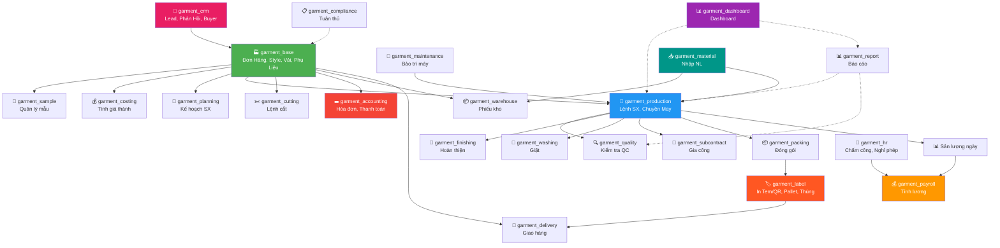

### 3.3 Luồng Chứng Từ

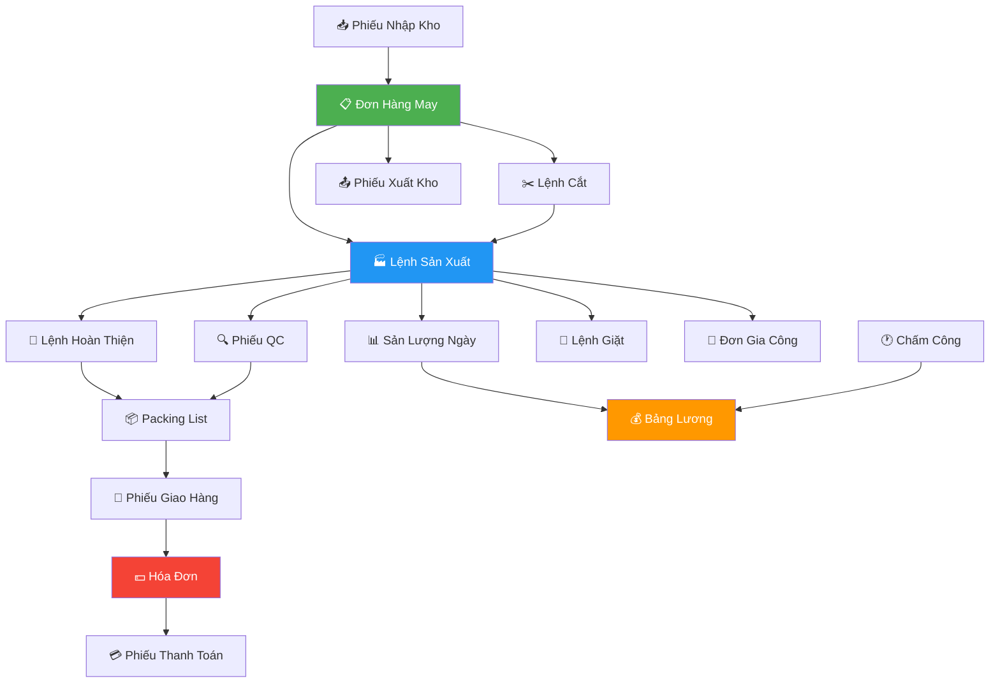

---

## 4. Vòng Đời Đơn Hàng

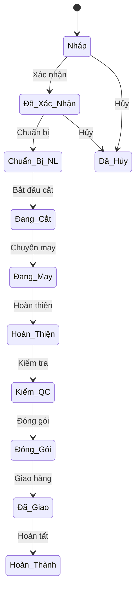

---

## 5. Hướng Dẫn Theo Chức Năng

### 5.1 Đơn Hàng & Style

**Đường dẫn:** `Công Ty May → Đơn Hàng`

| Thao tác | Cách thực hiện |
|----------|---------------|
| Tạo đơn hàng mới | Đơn Hàng May → **Tạo** → Chọn khách hàng, style → Thêm dòng chi tiết (màu, size, SL) → **Lưu** |
| Thêm mẫu may (Style) | Mẫu May / Style → **Tạo** → Điền tên, mã, loại SP → Upload tech pack → **Lưu** |
| Quản lý vải | Vải → **Tạo** → Tên, loại, khổ vải, giá → **Lưu** |
| Quản lý phụ liệu | Phụ Liệu → **Tạo** → Tên, loại, kích thước → **Lưu** |
| Tạo mẫu (Sample) | Quản Lý Mẫu → **Tạo** → Chọn style, loại mẫu (proto/fit/pp/top) → **Lưu** |
| Tính giá thành | Bảng Tính Giá Thành → **Tạo** → Chọn style → Thêm dòng chi phí (vải, PL, CM, ...) → **Lưu** |

#### Workflow mẫu may:

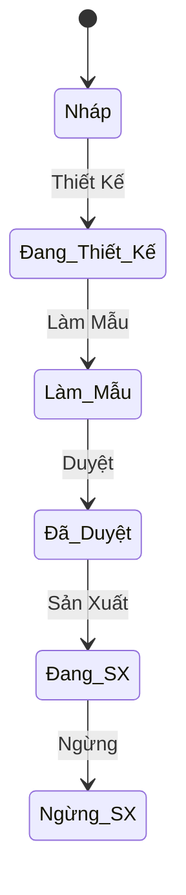

#### Workflow phiếu mẫu (Sample):

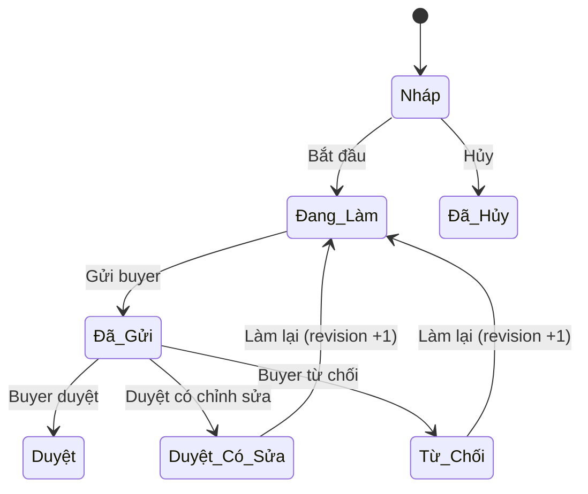

---

### 5.2 Sản Xuất

**Đường dẫn:** `Công Ty May → Sản Xuất`

| Thao tác | Cách thực hiện |
|----------|---------------|
| Tạo lệnh SX | Lệnh Sản Xuất → **Tạo** → Chọn đơn hàng, chuyền may → SL kế hoạch → **Xác nhận** |
| Nhập sản lượng ngày | Sản Lượng Ngày → **Tạo** → Chọn lệnh SX, ngày, ca → Nhập SL đạt, SL lỗi → **Lưu** |
| Tạo lệnh cắt | Lệnh Cắt → **Tạo** → Chọn đơn hàng, vải → Thêm lớp trải + bundle → **Xác nhận** |
| Lệnh hoàn thiện | Lệnh Hoàn Thiện → **Tạo** → Chọn lệnh SX → Nhập các task (cắt chỉ, ủi, gấp) → **Lưu** |
| Kế hoạch SX | Kế Hoạch SX → **Tạo** → Chọn đơn hàng → Phân chuyền (Line Loading) → **Xác nhận** |
| Quản lý chuyền | Chuyền May → **Tạo** → Tên, mã, loại, chuyền trưởng, CN → **Lưu** |
| Quản lý máy | Danh Sách Máy → **Tạo** → Loại, hãng, model, serial → Gắn chuyền → **Lưu** |
| Yêu cầu bảo trì | Yêu Cầu Bảo Trì → **Tạo** → Chọn máy, loại (định kỳ/sửa chữa/khẩn) → **Xác nhận** |

#### Workflow lệnh sản xuất:

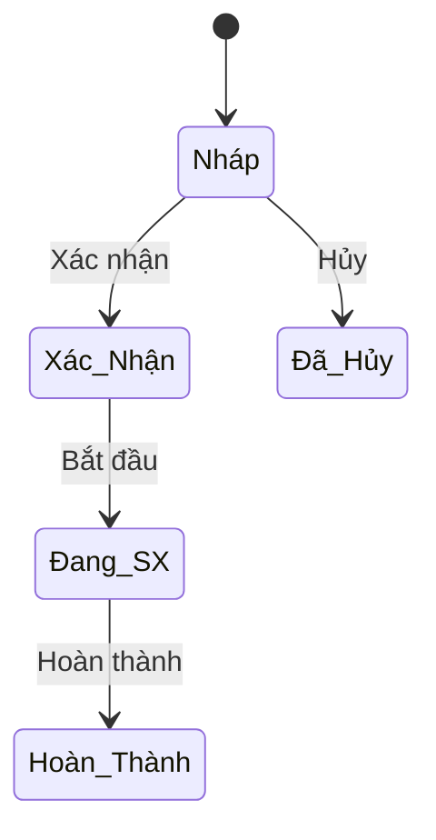

---

### 5.3 Giặt & Gia Công

**Đường dẫn:** `Công Ty May → Sản Xuất → Lệnh Giặt / Đơn Gia Công`

| Thao tác | Cách thực hiện |
|----------|---------------|
| Tạo lệnh giặt | Lệnh Giặt → **Tạo** → Chọn loại (nội bộ/gia công), lệnh SX, công thức giặt → Nhập SL → **Xác nhận** |
| Tạo đơn gia công | Đơn Gia Công → **Tạo** → Chọn loại (gửi/nhận), đối tác, công việc → Nhập chi tiết → **Xác nhận** |
| Thiết lập công thức giặt | Cấu Hình → Cấu Hình Giặt → Công Thức Giặt → **Tạo** → Loại giặt, nhiệt độ, hóa chất → **Lưu** |

#### Workflow giặt:

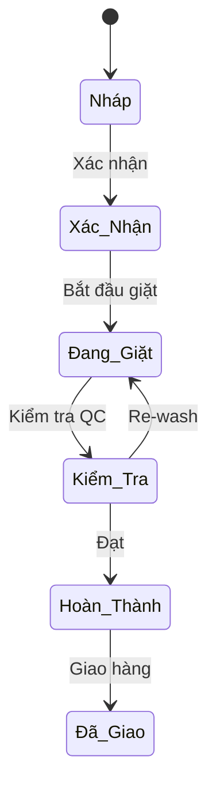

#### Workflow gia công:

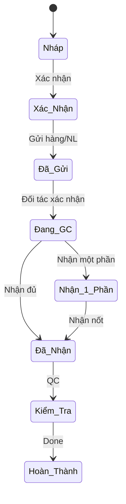

---

### 5.4 Chất Lượng & Tuân Thủ

**Đường dẫn:** `Công Ty May → Chất Lượng`

| Thao tác | Cách thực hiện |
|----------|---------------|
| Tạo phiếu QC | Phiếu Kiểm Tra QC → **Tạo** → Chọn lệnh SX, loại QC (inline/endline/final/AQL) → Nhập SL kiểm, SL lỗi → **Lưu** |
| Tạo audit | Audits → **Tạo** → Loại (BSCI/WRAP/SEDEX...), auditor → Thêm finding + CAP → **Lưu** |

> ⚠️ Không thể đóng audit khi còn CAP chưa hoàn thành.

---

### 5.5 Kho & Giao Hàng

**Đường dẫn:** `Công Ty May → Kho & Giao Hàng`

| Thao tác | Cách thực hiện |
|----------|---------------|
| Tạo packing list | Packing List → **Tạo** → Chọn khách hàng, đơn hàng → Nhập thông tin vận chuyển (PO, cảng, ETD) → Thêm dòng carton (thùng, màu, size, SL) → **Bắt Đầu Đóng** → **Đã Đóng** → **Xuất Hàng** |
| Nhập kho | Nhập Kho → **Tạo** → Loại = Nhập, chọn kho → Thêm dòng hàng → **Xác nhận** |
| Xuất kho | Xuất Kho → **Tạo** → Loại = Xuất, chọn kho → Thêm dòng hàng → **Xác nhận** |
| Tạo phiếu giao hàng | Phiếu Giao Hàng → **Tạo** → Chọn khách, đơn hàng, phương tiện → Nhập thông tin container/B/L → **Xác nhận** |
| Thêm phương tiện | Phương Tiện → **Tạo** → Loại xe, biển số, tải trọng → **Lưu** |

#### Workflow giao hàng:

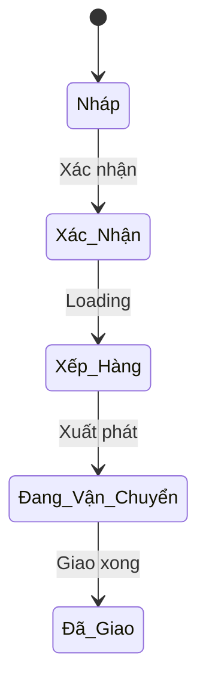

---

### 5.6 Kế Toán

**Đường dẫn:** `Công Ty May → Kế Toán`

| Thao tác | Cách thực hiện |
|----------|---------------|
| Tạo hóa đơn bán | Hóa Đơn Bán → **Tạo** → Chọn khách, đơn hàng → Thêm dòng (mô tả, SL, giá) → Chọn thuế GTGT → **Xác nhận** |
| Tạo hóa đơn mua | Hóa Đơn Mua → **Tạo** → Chọn NCC, phân loại chi phí → Thêm dòng → **Xác nhận** |
| Thanh toán | Phiếu Thanh Toán → **Tạo** → Chọn HĐ liên quan, phương thức (tiền mặt/CK/L/C) → Nhập số tiền → **Xác nhận** |

> 💡 Thuế GTGT 0% cho hàng xuất khẩu, 10% cho nội địa.

---

### 5.7 Nhân Sự & Lương

**Đường dẫn:** `Công Ty May → Nhân Sự & Lương`

| Thao tác | Cách thực hiện |
|----------|---------------|
| Chấm công | Chấm Công → **Tạo** → Chọn NV, ngày, trạng thái (đi làm/vắng/muộn) → Nhập giờ vào/ra → **Lưu** |
| Tổng hợp công tháng | Tổng Hợp Công Tháng → **Tạo** → Chọn NV, tháng/năm → Nhấn **"Tính Tổng"** |
| Tạo đơn nghỉ phép | Đơn Nghỉ Phép → **Tạo** → Chọn NV, loại nghỉ, từ ngày → đến ngày → **Gửi Duyệt** |
| Thiết lập đơn giá khoán | Đơn Giá Khoán → **Tạo** → Chọn style, công đoạn → Nhập đơn giá/SP → **Lưu** |
| Nhập sản lượng CN | Sản Lượng Công Nhân → **Tạo** → Chọn CN, lệnh SX, ngày → Nhập SL + giờ OT → **Lưu** |
| Tính lương tháng | Bảng Lương → **Tạo** → Chọn CN, tháng → Nhấn **"Tính Lương"** (tự pull chấm công + sản lượng) |
| Tạo phiếu thưởng | Phiếu Thưởng → **Tạo** → Chọn loại, tháng → Thêm dòng NV + số tiền → **Xác nhận** |

> 💡 Lương tự động tính: Lương cơ bản + Khoán sản phẩm + Tăng ca + Phụ cấp − BHXH (10.5%) − Thuế TNCN.

---

### 5.8 Báo Cáo

**Đường dẫn:** `Công Ty May → Báo Cáo`

| Báo cáo | Nội dung |
|---------|---------|
| **Hiệu Suất Chuyền** | So sánh năng suất thực tế vs mục tiêu, theo chuyền và style |
| **Phân Tích Lỗi** | Tỷ lệ lỗi theo loại, theo chuyền, trend theo thời gian |
| **Báo Cáo Sản Xuất** | Wizard lọc theo khoảng ngày, đơn hàng, chuyền |

---

### 5.9 Nhập Nguyên Liệu

**Đường dẫn:** `Công Ty May → Kho & Giao Hàng → Nhập NL Mua Hàng / NL Khách Gửi (CMT)`

| Thao tác | Mô tả |
|----------|-------|
| **Nhập NL Mua Hàng** | Tạo phiếu nhập từ NCC, chọn loại = "Mua Hàng", điền NCC + chi tiết NL |
| **NL Khách Gửi (CMT)** | Khách gửi NL để gia công, chọn loại = "Khách Gửi", điền khách hàng |
| **Kiểm tra QC** | Xác nhận → Kiểm tra → QC Đạt → Nhập Kho |
| **Phân bổ NL** | Cấp phát NL cho đơn hàng/lệnh SX (menu Phân Bổ NL Cho SX) |

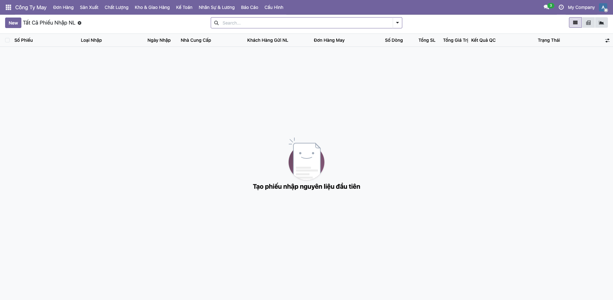

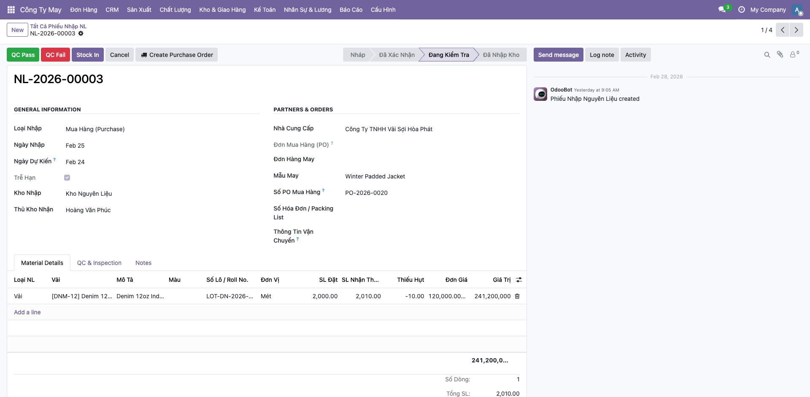

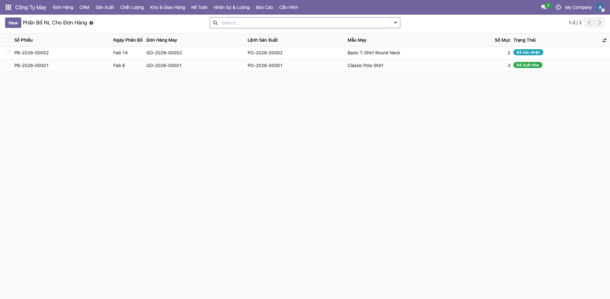

---

### 5.10 Dashboard — Bảng Điều Khiển

**Đường dẫn:** `Công Ty May → Báo Cáo → Dashboard`

| Báo cáo | Nội dung |
|---------|---------|
| **Tổng Quan KPI** | 17 chỉ số: đơn hàng, SX, QC, giao hàng, NL — biểu đồ tự động |
| **Tổng Quan Đơn Hàng** | Trạng thái, tiến độ %, ngày còn lại, trễ hạn — màu đỏ khi trễ |
| **Tiến Độ Sản Xuất** | % hoàn thành, SL lỗi, chuyền may, progressbar — xanh/vàng/đỏ |
| **Đơn Trễ Hạn** | Cảnh báo đơn quá ngày giao |
| **LSX Hoàn Thành Thấp** | LSX đang chạy nhưng < 50% |
| **LSX Lỗi Cao** | LSX có tỷ lệ lỗi > 5% |

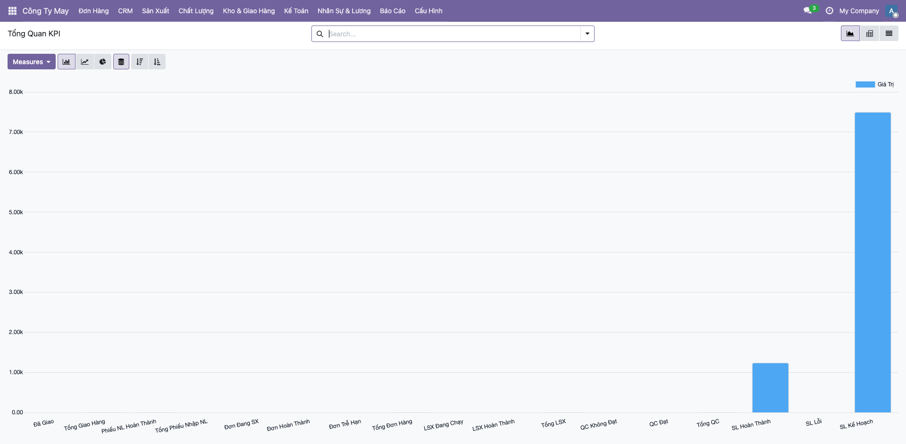

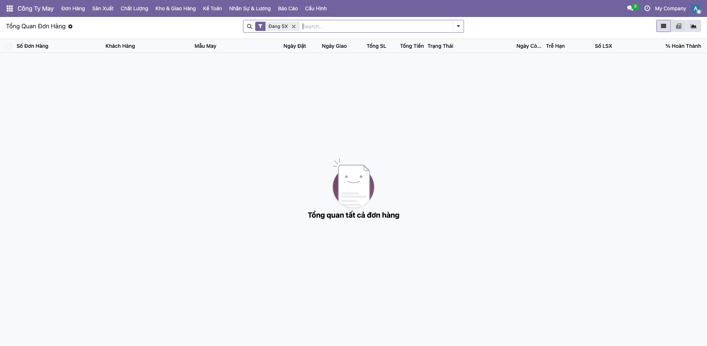

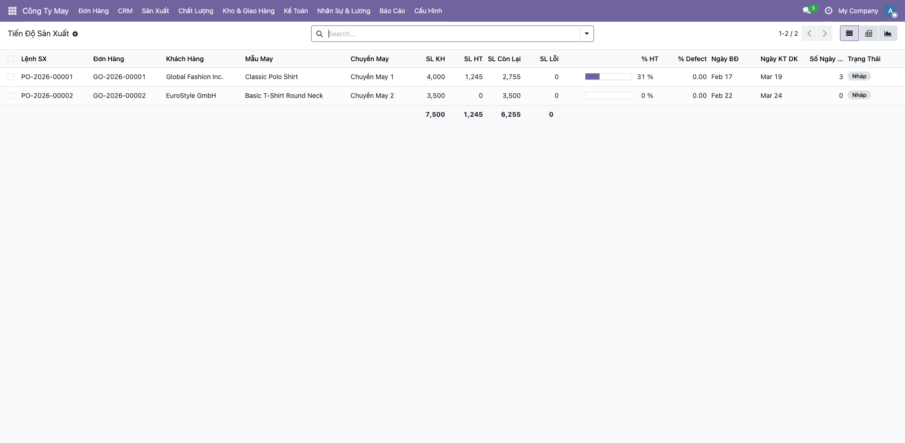

### 5.11 CRM — Quan Hệ Khách Hàng

| Chức Năng | Menu | Mô Tả |
|-----------|------|-------|
| Lead / Cơ Hội | CRM → Lead / Cơ Hội | Pipeline bán hàng: Lead → Đánh giá → Báo giá → Thương lượng → Chốt |
| Buyer / Khách Hàng | CRM → Buyer | Hồ sơ buyer ngành may, thống kê đơn hàng |
| Phản Hồi / Khiếu Nại | CRM → Phản Hồi | Theo dõi feedback, complaint, đánh giá hài lòng |

**Quick workflow CRM:**
1. Tạo Lead → Đánh giá → Gửi báo giá → Chốt thành công
2. Nhấn **📋 Tạo Đơn Hàng** → Tự động tạo đơn hàng may

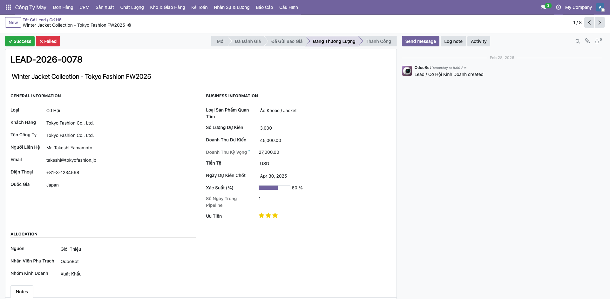

### 5.12 In Tem & Quản Lý Pallet

| Chức Năng | Menu | Mô Tả |
|-----------|------|-------|
| Tem QR Code | Kho → Tem / QR Code | In tem sản phẩm, thùng, pallet, vị trí kho |
| Thùng Hàng | Kho → Quản Lý Thùng | Đóng/tách/gộp thùng, tạo tem QR, xếp lên pallet |
| Pallet | Kho → Quản Lý Pallet | Tạo/đóng/tách/gộp pallet, theo dõi xuất hàng |

**Quick workflow:**
1. Đóng thùng hàng (nhập nội dung, SL, kích thước)
2. Tạo tem QR cho thùng (🏷 Tạo Tem QR)
3. Xếp thùng lên pallet → Đóng pallet → Xuất hàng

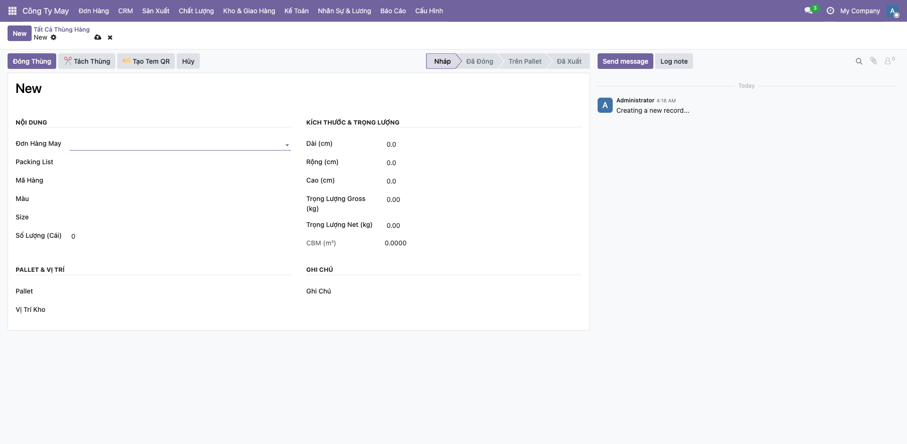
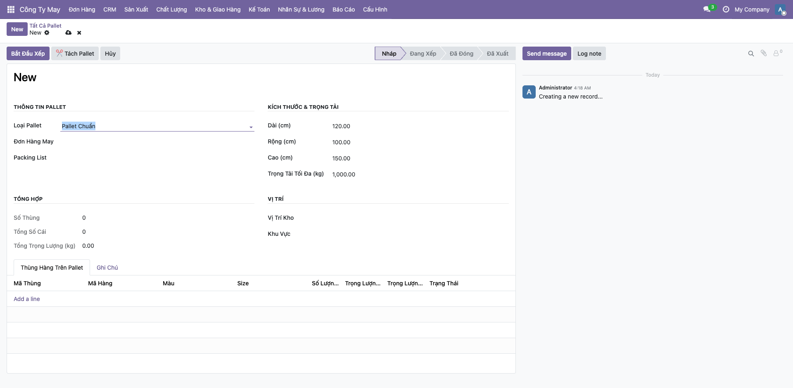

---

## 6. Phân Quyền

| Nhóm | Quyền |
|------|-------|
| **Garment User** | Xem tất cả, tạo/sửa đơn hàng & sản lượng |
| **Garment Manager** | Toàn quyền: tạo, sửa, xóa tất cả dữ liệu |

**Thiết lập:** Settings → Users → Chọn user → Tab Access Rights → Mục **Công Ty May** → Chọn User hoặc Manager.

---

## 7. FAQ

| Câu hỏi | Giải đáp |
|---------|---------|
| Đổi ngôn ngữ Tiếng Việt? | Settings → Translations → Load a Translation → Vietnamese |
| Mã tự động bị sai? | Settings → Technical → Sequences → Sửa Number Next |
| Import hàng loạt? | Trên danh sách → ⚙️ → Import records → Upload CSV/Excel |
| Hiệu suất chuyền = 0%? | Kiểm tra: chuyền có gắn CN không? Style có SAM không? Sản lượng ngày đã nhập chưa? |
| Tính lương không ra tiền khoán? | Kiểm tra Worker Output + Piece Rate đã nhập → Nhấn **"Tính Lương"** |
| Luồng nghiệp vụ chính? | Đơn hàng → Mẫu → Tính giá → Nhập NL → Kế hoạch → Cắt → May → Giặt → Hoàn thiện → QC → Đóng gói → Giao hàng → Kế toán |

---

> 📖 **Tài liệu đầy đủ:** [USER_GUIDE.md](USER_GUIDE.md) — bao gồm giải thích chi tiết từng trường dữ liệu của tất cả 24 module.
>
> 📞 **Hỗ trợ:** Liên hệ đội phát triển | 📚 [Odoo Docs](https://www.odoo.com/documentation/19.0/)
