# 📖 Tài Liệu Hướng Dẫn Sử Dụng - Hệ Thống Quản Lý Công Ty May

> **Phiên bản:** Odoo 19.0 | **Ngày cập nhật:** Tháng 2/2026
> **Đối tượng:** Quản lý, trưởng phòng, nhân viên sử dụng hệ thống ERP
> **Tổng số module:** 20 module chuyên biệt | **181 test cases** — 0 failures---

## 📑 Mục Lục

1. [Giới thiệu & Đăng nhập](#1-giới-thiệu--đăng-nhập)
2. [Sơ Đồ Tổng Quan & Luồng Nghiệp Vụ](#2-sơ-đồ-tổng-quan--luồng-nghiệp-vụ)
3. [Module Garment Base — Quản lý cơ sở](#3-module-garment-base--quản-lý-cơ-sở)
4. [Module Garment Production — Sản xuất](#4-module-garment-production--sản-xuất)
5. [Module Garment Quality — Chất lượng](#5-module-garment-quality--chất-lượng)
6. [Module Garment Costing — Tính giá thành](#6-module-garment-costing--tính-giá-thành)
7. [Module Garment Sample — Quản lý mẫu](#7-module-garment-sample--quản-lý-mẫu)
8. [Module Garment Cutting — Cắt nâng cao](#8-module-garment-cutting--cắt-nâng-cao)
9. [Module Garment Packing — Đóng gói & xuất hàng](#9-module-garment-packing--đóng-gói--xuất-hàng)
10. [Module Garment Planning — Kế hoạch sản xuất](#10-module-garment-planning--kế-hoạch-sản-xuất)
11. [Module Garment Maintenance — Bảo trì máy](#11-module-garment-maintenance--bảo-trì-máy)
12. [Module Garment Payroll — Lương khoán](#12-module-garment-payroll--lương-khoán)
13. [Module Garment Compliance — Tuân thủ](#13-module-garment-compliance--tuân-thủ)
14. [Module Garment Report — Báo cáo](#14-module-garment-report--báo-cáo)
15. [Module Garment Washing — Xưởng Giặt](#15-module-garment-washing--xưởng-giặt)
16. [Module Garment Subcontract — Gia Công](#16-module-garment-subcontract--gia-công)
17. [Module Garment Finishing — Hoàn Thiện](#17-module-garment-finishing--hoàn-thiện)
18. [Module Garment HR — Nhân Sự & Chấm Công](#18-module-garment-hr--nhân-sự--chấm-công)
19. [Module Garment Accounting — Kế Toán VN](#19-module-garment-accounting--kế-toán-vn)
20. [Module Garment Warehouse — Quản Lý Kho](#20-module-garment-warehouse--quản-lý-kho)
21. [Module Garment Delivery — Giao Hàng](#21-module-garment-delivery--giao-hàng)
22. [Phân quyền & Bảo mật](#22-phân-quyền--bảo-mật)
23. [FAQ — Câu hỏi thường gặp](#23-faq--câu-hỏi-thường-gặp)

---

## 1. Giới thiệu & Đăng nhập

### 1.1 Tổng quan hệ thống

Hệ thống ERP Công Ty May được xây dựng trên nền tảng **Odoo 19.0**, bao gồm **20 module chuyên biệt** quản lý toàn bộ quy trình từ nhận đơn hàng đến xuất hàng, bao gồm hoàn thiện, chấm công, kế toán, kho, giặt, gia công và giao hàng.

### 1.2 Đăng nhập

1. Mở trình duyệt → Truy cập **http://localhost:8069**
2. Nhập tài khoản:
   - **Email:** `admin`
   - **Password:** `admin`
3. Nhấn **Log in**

*Hình 1: Trang đăng nhập hệ thống*

> 💡 **Mẹo:** Bookmark trang đăng nhập để truy cập nhanh hơn.

### 1.3 Giao diện chính

Sau khi đăng nhập, bạn sẽ thấy:

- **App Launcher (Home):** Chỉ có **1 ứng dụng duy nhất** — **"Công Ty May"** chứa toàn bộ chức năng
- **Thanh menu ngang:** Các nhóm chức năng chính bên trong app (Đơn Hàng, Sản Xuất, Chất Lượng, ...)
- **Sidebar trái:** Menu phụ của nhóm đang chọn
- **Vùng nội dung chính:** Hiển thị danh sách / form / biểu đồ

*Hình 2: Giao diện chính sau khi đăng nhập — chỉ hiển thị app "Công Ty May"*

### 1.4 Truy cập module Công Ty May

Nhấn vào **"Công Ty May"** trên màn hình Home. Toàn bộ chức năng được tổ chức trong **8 nhóm menu** trên thanh ngang:

| # | Menu Nhóm | Chức Năng |
|---|-----------|-----------|
| 1 | **Đơn Hàng** | Đơn hàng may, Mẫu may/Style, Vải, Phụ liệu, Quản lý mẫu, Bảng tính giá thành |
| 2 | **Sản Xuất** | Lệnh SX, Lệnh cắt, Lệnh cắt nâng cao, Sản lượng ngày, Chuyền may, Lệnh hoàn thiện, Kế hoạch SX, Line loading, Danh sách máy, Yêu cầu bảo trì, Lệnh giặt, Đơn gia công |
| 3 | **Chất Lượng** | Phiếu kiểm tra QC, Loại lỗi, Audits, CAP (Khắc phục) |
| 4 | **Kho & Giao Hàng** | Packing list, Nhập kho, Xuất kho, Tất cả phiếu kho, Phiếu giao hàng, Giao khách hàng, Phương tiện |
| 5 | **Kế Toán** | Hóa đơn bán, Hóa đơn mua, Phiếu thanh toán, Tất cả hóa đơn |
| 6 | **Nhân Sự & Lương** | Chấm công, Tổng hợp công tháng, Tay nghề, Đơn nghỉ phép, Đơn giá khoán, Sản lượng CN, Bảng lương, Phiếu thưởng |
| 7 | **Báo Cáo** | Hiệu suất chuyền, Phân tích lỗi, Báo cáo sản xuất |
| 8 | **Cấu Hình** | Bảng màu, Bảng size, Ký hiệu giặt, Công thức giặt, Hóa chất |

*Hình 2b: Menu "Đơn Hàng" — tất cả chức năng đặt hàng trong một nhóm*

*Hình 2c: Menu "Sản Xuất" — bao gồm cả Giặt, Gia Công, Bảo Trì, Kế Hoạch*

*Hình 2d: Menu "Kho & Giao Hàng" — Packing, Kho và Giao Hàng gộp chung*

*Hình 2e: Menu "Cấu Hình" — Bảng màu, Bảng size, Ký hiệu giặt, Công thức, Hóa chất*

---

## 2. Sơ Đồ Tổng Quan & Luồng Nghiệp Vụ

### 2.1 Luồng Nghiệp Vụ Chính — Từ Đơn Hàng Đến Giao Hàng

### 2.2 Sơ Đồ Liên Kết Giữa Các Module

### 2.3 Luồng Chứng Từ — Document Flow

### 2.4 Trạng Thái Đơn Hàng (Order Lifecycle)

```mermaid
stateDiagram-v2
    [*] --> Nháp
    Nháp --> Đã_Xác_Nhận: Xác nhận
    Đã_Xác_Nhận --> Chuẩn_Bị_NL: Chuẩn bị
    Chuẩn_Bị_NL --> Đang_Cắt: Bắt đầu cắt
    Đang_Cắt --> Đang_May: Chuyển may
    Đang_May --> Hoàn_Thiện: Hoàn thiện
    Hoàn_Thiện --> Kiểm_QC: Kiểm tra
    Kiểm_QC --> Đóng_Gói: Đóng gói
    Đóng_Gói --> Đã_Giao: Giao hàng
    Đã_Giao --> Hoàn_Thành: Hoàn tất
    Nháp --> Đã_Hủy: Hủy
    Đã_Xác_Nhận --> Đã_Hủy: Hủy
```

---

## 3. Module Garment Base — Quản lý Cơ Sở

Module nền tảng quản lý tất cả dữ liệu chung của công ty may.

### 3.1 Quản lý Vải (Fabric)

**Đường dẫn:** `Công Ty May → Đơn Hàng → Vải`

#### Thêm mới loại vải:

1. Nhấn **"Tạo"** (nút xanh góc trái)
2. Điền thông tin vải
3. Tab **Nhà Cung Cấp:** Thêm nhà cung cấp vải
4. Tab **Màu Có Sẵn:** Chọn màu vải có sẵn
5. Nhấn **"Lưu"**

*Hình 2e: Danh sách quản lý vải*

#### Bảng giải thích trường — Vải (garment.fabric):

| Trường | Kiểu | Ý Nghĩa | Ví dụ |
|--------|------|---------|-------|
| **Tên Vải** | Char | Tên gọi đầy đủ của loại vải | `Cotton Oxford 100%` |
| **Mã Vải** | Char | Mã nội bộ duy nhất để quản lý | `FAB-001` |
| **Loại Vải** | Selection | Phân loại: Cotton, Polyester, Silk, Denim, Linen, Blend, Knit, Nylon, Rayon, Spandex, Khác | `cotton` |
| **Thành Phần** | Char | Tỷ lệ sợi | `60% Cotton 40% Polyester` |
| **Khổ Vải (cm)** | Float | Chiều rộng cuộn vải, ảnh hưởng đến sơ đồ cắt | `150` |
| **Định Lượng (g/m²)** | Float | Trọng lượng/m², quyết định loại kim may | `140` |
| **Giá / Mét** | Float | Đơn giá nhập vải từ nhà cung cấp | `45000` |
| **Đặt Hàng Tối Thiểu** | Float | MOQ (Minimum Order Quantity) từ NCC | `500` |
| **Thời Gian Giao (ngày)** | Integer | Lead time, ảnh hưởng kế hoạch SX | `14` |
| **Độ Co Rút (%)** | Float | % co rút sau giặt, cần tính thêm khi cắt | `3.0` |

---

### 3.2 Quản lý Phụ Liệu (Accessories)

**Đường dẫn:** `Công Ty May → Đơn Hàng → Phụ Liệu`

*Hình 2f: Danh sách quản lý phụ liệu*

#### Bảng giải thích trường — Phụ Liệu (garment.accessory):

| Trường | Kiểu | Ý Nghĩa | Ví dụ |
|--------|------|---------|-------|
| **Tên** | Char | Tên phụ liệu | `Nút nhựa 4 lỗ 15mm` |
| **Mã** | Char | Mã nội bộ | `ACC-001` |
| **Loại** | Selection | button (Nút/Cúc), zipper (Khóa Kéo), thread (Chỉ May), label (Nhãn Mác), elastic (Thun), lace (Ren), ribbon (Ruy Băng), hook_eye (Móc/Khuy), interlining (Mex/Lót), packaging (Bao Bì), hanger (Móc Treo), tag (Thẻ Bài), other (Khác) | `button` |
| **Đơn Vị Tính** | Selection | pcs (Cái), m (Mét), roll (Cuộn), kg (Kg), set (Bộ), box (Hộp), other (Khác) | `pcs` |
| **Kích Thước** | Char | Kích thước chi tiết | `15mm` |
| **Chất Liệu** | Char | Vật liệu phụ liệu | `Nhựa ABS` |
| **Giá** | Float | Đơn giá mua | `500` |
| **Nhà Cung Cấp** | Many2one → res.partner | Nhà cung cấp phụ liệu | `Công ty ABC` |

---

### 3.3 Quản lý Mẫu May / Style

**Đường dẫn:** `Công Ty May → Đơn Hàng → Mẫu May / Style`

*Hình 3: Danh sách mã hàng (Style) trong hệ thống*

*Hình 4: Màn hình chi tiết mẫu may — form view đầy đủ*

#### Bảng giải thích trường — Mẫu May (garment.style):

| Trường | Kiểu | Bắt buộc | Ý Nghĩa | Giá trị / Ví dụ |
|--------|------|----------|---------|-----------------|
| **Tên Mẫu** | Char | ✅ | Tên gọi mẫu may | `Áo Polo nam cổ đứng` |
| **Mã Mẫu (Style No.)** | Char | ✅ | Mã duy nhất do khách/nội bộ đặt | `STY-2026-001` |
| **Loại Sản Phẩm** | Selection | ✅ | Phân loại sản phẩm: shirt (Áo Sơ Mi), tshirt (Áo Thun), polo (Polo), jacket (Jacket), blazer (Vest), pants (Quần Tây), jeans (Jeans), shorts (Short), skirt (Chân Váy), dress (Đầm), suit (Bộ Vest), uniform (Đồng Phục), sportswear (Thể Thao), underwear (Đồ Lót), sleepwear (Đồ Ngủ), childwear (Trẻ Em), other (Khác) | `polo` |
| **Mùa** | Selection | | ss (Xuân Hè), aw (Thu Đông), all (Quanh Năm) | `ss` |
| **Giới Tính** | Selection | | male / female / unisex / kids | `unisex` |
| **Khách Hàng** | Many2one | | Buyer đặt hàng mẫu này | `H&M Vietnam` |
| **Độ Khó** | Selection | | easy / medium / hard / very_hard — ảnh hưởng đến SAM | `medium` |
| **Định Mức Vải (m/sp)** | Float | | Số mét vải cần cho 1 sản phẩm | `1.85` |
| **Thời Gian May (phút/sp)** | Float | | Thời gian may trung bình 1 SP | `18` |
| **SAM** | Float | | Standard Allowed Minutes — thời gian chuẩn cho phép (phút) | `15.5` |
| **Vải Sử Dụng** | Many2many | | Gắn các loại vải cho mẫu này | `Cotton Oxford, Lót Polyester` |
| **Phụ Liệu Sử Dụng** | Many2many | | Gắn phụ liệu cần thiết | `Nút nhựa, Khóa kéo, Nhãn` |
| **Bảng Size** | Many2many | | Size sản xuất cho mẫu này | `S, M, L, XL, XXL` |
| **Bảng Màu** | Many2many | | Màu sản xuất cho mẫu này | `Trắng, Đen, Navy` |
| **Hướng Dẫn Giặt Ủi** | Text | | Wash care instruction | `Giặt máy 30°C, không tẩy` |
| **Ký Hiệu Giặt** | Many2many | | Ký hiệu giặt ISO trên nhãn | `W30, DNB, MI` |
| **Tech Pack** | Binary | | File PDF/JPG tài liệu kỹ thuật | Upload file |
| **File Rập / Pattern** | Binary | | File rập cắt | Upload file |
| **Hình Mặt Trước / Sau** | Binary | | Hình ảnh sản phẩm | Upload ảnh |
| **Trạng Thái** | Selection | | draft → design → sample → approved → production → discontinued | `approved` |

#### Workflow mẫu may:

```mermaid
stateDiagram-v2
    [*] --> Nháp
    Nháp --> Đang_Thiết_Kế: Thiết Kế
    Đang_Thiết_Kế --> Làm_Mẫu: Làm Mẫu
    Làm_Mẫu --> Đã_Duyệt: Duyệt
    Đã_Duyệt --> Đang_SX: Sản Xuất
    Đang_SX --> Ngừng_SX: Ngừng
```

---

### 3.4 Quản lý Đơn Hàng

**Đường dẫn:** `Công Ty May → Đơn Hàng → Đơn Hàng May`

*Hình 5: Danh sách đơn hàng may*

*Hình 6: Màn hình chi tiết đơn hàng — form view với đầy đủ thông tin*

#### Bảng giải thích trường — Đơn Hàng (garment.order):

| Trường | Kiểu | Bắt buộc | Ý Nghĩa | Giá trị / Ví dụ |
|--------|------|----------|---------|-----------------|
| **Số Đơn Hàng** | Char | ✅ | Mã tự động (GO-2026-XXXXX) | `GO-2026-00001` |
| **Khách Hàng** | Many2one | ✅ | Buyer đặt hàng (có rank customer) | `H&M Vietnam` |
| **PO Khách Hàng** | Char | | Mã PO từ phía khách hàng | `PO-HM-2026-458` |
| **Mẫu May** | Many2one | ✅ | Style sản xuất | `Áo Polo nam cổ đứng` |
| **Ngày Đặt Hàng** | Date | | Ngày ký hợp đồng / nhận PO | `2026-01-15` |
| **Ngày Giao Hàng** | Date | | Deadline giao hàng | `2026-03-30` |
| **Đơn Giá FOB** | Float | | Giá FOB cho 1 sản phẩm | `8.50` (USD) |
| **Tiền Tệ** | Many2one | | Loại tiền (mặc định = tiền công ty) | `USD` |
| **Phương Thức Thanh Toán** | Selection | | tt (T/T Chuyển Khoản), lc (L/C Thư Tín Dụng), dp (D/P), da (D/A) | `tt` |
| **Điều Kiện Giao Hàng** | Selection | | fob (FOB), cif (CIF), exw (EXW), cfr (CFR) | `fob` |
| **Cảng Đến** | Char | | Cảng đích cho hàng xuất khẩu | `Hamburg, Germany` |
| **Shipping Mark** | Text | | Ký hiệu đóng gói trên thùng hàng | `H&M / PO-458 / ...` |
| **Tổng Số Lượng** | Integer | 🔄 | Tự tính từ tổng các dòng chi tiết | `10,000` |
| **Tổng Tiền** | Float | 🔄 | Tự tính = Tổng SL × Đơn giá | `85,000` |
| **Đúng Hạn** | Boolean | 🔄 | Tự tính từ ngày giao so với hôm nay | ✅/❌ |
| **Số Ngày Còn Lại** | Integer | 🔄 | Tự tính số ngày đến deadline | `45` |
| **Trạng Thái** | Selection | | 11 trạng thái: draft, confirmed, material, cutting, sewing, finishing, qc, packing, shipped, done, cancelled | `confirmed` |

> 🔄 = Trường tự động tính, không cần nhập tay.

#### Chi tiết đơn hàng (Order Line):

| Trường | Ý Nghĩa |
|--------|---------|
| **Màu** | Màu sản phẩm trong đơn |
| **Size** | Size sản phẩm |
| **Số Lượng** | Số lượng đặt cho combo màu-size |
| **Đơn Giá** | Lấy từ đơn giá FOB của đơn hàng |
| **Thành Tiền** | Tự tính = Số lượng × Đơn giá |

---

## 4. Module Garment Production — Sản Xuất

Module quản lý sản xuất: chuyền may, lệnh sản xuất, sản lượng hàng ngày.

*Hình 7b: Menu Sản Xuất — bao gồm cả Giặt, Gia Công, Bảo Trì, Kế Hoạch SX*

### 4.1 Chuyền May (Sewing Line)

**Đường dẫn:** `Công Ty May → Sản Xuất → Chuyền May`

*Hình 7: Danh sách chuyền may*

*Hình 8: Form view chi tiết chuyền may*

#### Bảng giải thích trường — Chuyền May (garment.sewing.line):

| Trường | Kiểu | Bắt buộc | Ý Nghĩa | Giá trị / Ví dụ |
|--------|------|----------|---------|-----------------|
| **Tên Chuyền** | Char | ✅ | Tên gọi chuyền | `Chuyền May 1` |
| **Mã Chuyền** | Char | ✅ | Mã duy nhất | `LINE-01` |
| **Loại Chuyền** | Selection | ✅ | sewing (May), cutting (Bàn Cắt), finishing (Hoàn Thiện), ironing (Ủi), packing (Đóng Gói) | `sewing` |
| **Chuyền Trưởng** | Many2one | | Người quản lý chuyền | `Nguyễn Văn A` |
| **Công Nhân** | Many2many | | Danh sách CN trong chuyền | 35 người |
| **Số Công Nhân** | Integer | 🔄 | Tự tính từ danh sách CN | `35` |
| **Số Máy** | Integer | | Tổng số máy trong chuyền | `40` |
| **Năng Suất / Ngày (sp)** | Integer | | Capacity dự kiến | `800` |
| **Hiệu Suất (%)** | Float | | Hiệu suất trung bình | `80.0` |
| **Vị Trí / Nhà Xưởng** | Char | | Vị trí vật lý | `Nhà xưởng A - Tầng 2` |
| **Trạng Thái** | Selection | | active / maintenance / inactive | `active` |

---

### 4.2 Lệnh Sản Xuất (Production Order)

**Đường dẫn:** `Công Ty May → Sản Xuất → Lệnh Sản Xuất`

*Hình 9: Danh sách lệnh sản xuất*

*Hình 10: Form view chi tiết lệnh sản xuất — hiển thị tiến độ, sản lượng*

#### Bảng giải thích trường — Lệnh Sản Xuất (garment.production.order):

| Trường | Kiểu | Bắt buộc | Ý Nghĩa | Giá trị / Ví dụ |
|--------|------|----------|---------|-----------------|
| **Số Lệnh SX** | Char | ✅ | Mã tự động (PO-2026-XXXXX) | `PO-2026-00001` |
| **Đơn Hàng May** | Many2one | ✅ | Liên kết đến đơn hàng gốc | `GO-2026-00001` |
| **Mẫu May** | Many2one | 🔄 | Lấy từ đơn hàng may (related) | `Áo Polo nam` |
| **Khách Hàng** | Many2one | 🔄 | Lấy từ đơn hàng (related) | `H&M Vietnam` |
| **Chuyền May** | Many2one | | Phân chuyền may thực hiện | `Chuyền May 1` |
| **SL Kế Hoạch** | Integer | ✅ | Số lượng cần sản xuất | `5,000` |
| **SL Hoàn Thành** | Integer | 🔄 | Tự tính từ sản lượng ngày | `3,200` |
| **SL Lỗi** | Integer | 🔄 | Tự tính từ sản lượng ngày | `45` |
| **Tỷ Lệ Hoàn Thành (%)** | Float | 🔄 | = SL Hoàn Thành / SL Kế Hoạch × 100 | `64.0%` |
| **Ngày Bắt Đầu** | Date | | Tự set khi chuyển trạng thái | `2026-02-01` |
| **Ngày Kết Thúc Dự Kiến** | Date | | Deadline cho lệnh SX | `2026-02-28` |
| **Ngày Kết Thúc Thực Tế** | Date | | Tự set khi hoàn thành | `2026-02-26` |
| **SAM** | Float | 🔄 | Lấy từ mẫu may (related) | `15.5` |
| **Trạng Thái** | Selection | | draft → confirmed → in_progress → done / cancelled | `in_progress` |

#### Workflow lệnh sản xuất:

```mermaid
stateDiagram-v2
    [*] --> Nháp
    Nháp --> Xác_Nhận: Xác nhận
    Xác_Nhận --> Đang_SX: Bắt đầu
    Đang_SX --> Hoàn_Thành: Hoàn thành
    Nháp --> Đã_Hủy: Hủy
```

---

### 4.3 Sản Lượng Hàng Ngày (Daily Output)

**Đường dẫn:** `Công Ty May → Sản Xuất → Sản Lượng Hàng Ngày`

*Hình 11: Danh sách sản lượng hàng ngày*

*Hình 12: Form view chi tiết sản lượng hàng ngày*

#### Bảng giải thích trường — Sản Lượng (garment.daily.output):

| Trường | Kiểu | Bắt buộc | Ý Nghĩa | Giá trị / Ví dụ |
|--------|------|----------|---------|-----------------|
| **Lệnh Sản Xuất** | Many2one | ✅ | Liên kết đến lệnh SX | `PO-2026-00001` |
| **Chuyền May** | Many2one | 🔄 | Lấy từ lệnh SX (related) | `Chuyền May 1` |
| **Ngày** | Date | ✅ | Ngày nhập sản lượng | `2026-02-15` |
| **Ca Làm Việc** | Selection | ✅ | morning (Ca Sáng), afternoon (Ca Chiều), night (Ca Tối), overtime (Tăng Ca) | `morning` |
| **Mục Tiêu (sp)** | Integer | | SL mục tiêu trong ca | `200` |
| **Sản Lượng Đạt (sp)** | Integer | ✅ | SL thực tế hoàn thành | `185` |
| **Số Lượng Lỗi (sp)** | Integer | | SL lỗi phát hiện | `8` |
| **Sửa Lại (sp)** | Integer | | SL sửa chữa (rework) | `5` |
| **Số CN Làm Việc** | Integer | | Số công nhân trong ca | `35` |
| **Giờ Làm Việc** | Float | | Giờ làm việc thực tế | `8.0` |
| **Hiệu Suất (%)** | Float | 🔄 | = SL Đạt / Mục Tiêu × 100 | `92.5%` |
| **Tỷ Lệ Lỗi (%)** | Float | 🔄 | = Lỗi / (Đạt + Lỗi) × 100 | `4.1%` |

---

## 5. Module Garment Quality — Chất Lượng

Module quản lý kiểm tra chất lượng (QC) trong sản xuất.

### 5.1 Phiếu Kiểm Tra QC (QC Inspection)

**Đường dẫn:** `Công Ty May → Chất Lượng → Phiếu Kiểm Tra QC`

*Hình 12b: Menu Chất Lượng — QC, Audits và CAP gộp chung*

*Hình 13: Danh sách phiếu kiểm tra QC*

*Hình 14: Form view chi tiết phiếu QC — kết quả kiểm tra*

#### Bảng giải thích trường — QC Inspection (garment.qc.inspection):

| Trường | Kiểu | Bắt buộc | Ý Nghĩa | Giá trị / Ví dụ |
|--------|------|----------|---------|-----------------|
| **Mã Phiếu** | Char | ✅ | Mã tự động (QC-XXXXX) | `QC-2026-00001` |
| **Lệnh Sản Xuất** | Many2one | ✅ | Lệnh SX được kiểm tra | `PO-2026-00001` |
| **Loại QC** | Selection | ✅ | inline (Kiểm Tra Chuyền), endline (Kiểm Cuối Chuyền), final (Kiểm Cuối Cùng), aql (Kiểm AQL), fabric (Kiểm Vải), washing (Kiểm Sau Giặt) | `final` |
| **Mức AQL** | Selection | | 1.0 / 1.5 / 2.5 / 4.0 / 6.5 | `2.5` |
| **Ngày Kiểm Tra** | Date | ✅ | Ngày thực hiện | `2026-02-20` |
| **QC Inspector** | Many2one | | Nhân viên QC thực hiện | `Lê Thị QC` |
| **SL Kiểm Tra** | Integer | ✅ | Số lượng mẫu kiểm | `200` |
| **SL Đạt** | Integer | | SL đạt yêu cầu | `190` |
| **SL Lỗi** | Integer | | SL phát hiện lỗi | `10` |
| **Tỷ Lệ Lỗi (%)** | Float | 🔄 | Tự tính | `5.0%` |
| **Kết Quả** | Selection | | pass (Đạt), fail (Không Đạt), conditional (Đạt Có Điều Kiện) | `pass` |
| **Chi Tiết Lỗi** | One2many | | Danh sách lỗi phát hiện | Bảng lỗi |
| **Trạng Thái** | Selection | | draft → in_progress → done / cancelled | `done` |

---

## 6. Module Garment Costing — Tính Giá Thành

**Đường dẫn:** `Công Ty May → Đơn Hàng → Bảng Tính Giá Thành`

*Hình 15: Danh sách bảng tính giá thành*

*Hình 16: Form view bảng tính giá thành — breakdown chi phí*

### 6.1 Bảng Tính Giá Thành (Cost Sheet)

#### Bảng giải thích trường — Cost Sheet (garment.cost.sheet):

| Trường | Kiểu | Bắt buộc | Ý Nghĩa | Giá trị / Ví dụ |
|--------|------|----------|---------|-----------------|
| **Mã** | Char | ✅ | Mã tự động (CS-XXXXX) | `CS-2026-00001` |
| **Mẫu May** | Many2one | ✅ | Style được tính giá | `Áo Polo nam` |
| **Khách Hàng** | Many2one | ✅ | Buyer yêu cầu | `H&M Vietnam` |
| **Đơn Hàng** | Many2one | | Đơn hàng may liên kết | `GO-2026-00001` |
| **Ngày** | Date | ✅ | Ngày lập bảng giá | `2026-01-15` |
| **Tiền Tệ** | Many2one | ✅ | Loại tiền tính giá | `USD` |
| **Loại Tính Giá** | Selection | ✅ | fob (FOB), cm (CM — Cut & Make), cmt (CMT — Cut, Make & Trim) | `fob` |
| **SL Đặt Hàng** | Integer | ✅ | Số lượng đơn hàng | `10,000` |
| **Chi Phí Vải** | One2many | | Dòng chi phí vải (từ Cost Line, cost_type=fabric) | Bảng chi tiết |
| **Chi Phí PL** | One2many | | Dòng chi phí phụ liệu (cost_type=accessory) | Bảng chi tiết |
| **Chi Phí Đóng Gói** | One2many | | Dòng chi phí đóng gói (cost_type=packing) | Bảng chi tiết |
| **Chi Phí Khác** | One2many | | Dòng chi phí khác (cost_type=other) | Bảng chi tiết |
| **Tổng NVL/SP** | Monetary | 🔄 | = Vải + PL + Đóng Gói + Khác (per pc) | `3.50` |
| **SMV** | Float | | Standard Minute Value — thời gian may 1 SP (phút) | `12.5` |
| **Hiệu Suất Mục Tiêu (%)** | Float | | Target efficiency | `60.0` |
| **Đơn Giá CM/Phút** | Monetary | | Giá gia công mỗi phút | `0.05` |
| **Chi Phí CM/SP** | Monetary | 🔄 | = SMV ÷ (Efficiency/100) × CM Rate | `1.04` |
| **Chi Phí Giặt/SP** | Monetary | | Washing cost per piece | `0.30` |
| **Chi Phí Thêu/SP** | Monetary | | Embroidery cost per piece | `0.20` |
| **Chi Phí In/SP** | Monetary | | Printing cost per piece | `0.00` |
| **Chi Phí Test/SP** | Monetary | | Testing cost per piece | `0.10` |
| **Tổng Gia Công/SP** | Monetary | 🔄 | = Giặt + Thêu + In + Test | `0.60` |
| **Hoa Hồng (%)** | Float | | Commission % (chỉ cho FOB) | `3.0` |
| **Freight/SP** | Monetary | | Inland freight per piece | `0.15` |
| **Overhead (%)** | Float | | Overhead % | `5.0` |
| **Lợi Nhuận (%)** | Float | | Profit margin % | `5.0` |
| **Giá Thành/SP** | Monetary | 🔄 | Cost price per piece (tuỳ loại FOB/CM/CMT) | `5.29` |
| **Giá Bán/SP** | Monetary | 🔄 | Selling price per piece (gồm overhead + profit) | `6.80` |
| **Tổng Giá Trị Đơn Hàng** | Monetary | 🔄 | = Giá Bán × SL Đặt Hàng | `68,000` |
| **Revision** | Integer | | Số lần sửa đổi bảng giá | `0` |
| **Trạng Thái** | Selection | | draft → confirmed → approved → revised → cancelled | `approved` |

> 💡 **Công thức tính giá:**
> - **FOB:** Cost = NVL + CM + Gia Công + Overhead + Freight → Selling = Cost + Commission + Profit
> - **CM:** Cost = CM only → Selling = CM + Overhead + Profit
> - **CMT:** Cost = PL + CM + Gia Công → Selling = Cost + Overhead + Profit

### 6.2 Chi Tiết Chi Phí (Cost Line — garment.cost.line):

| Trường | Ý Nghĩa |
|--------|---------|
| **Loại Chi Phí** | fabric (Vải) / accessory (Phụ Liệu) / packing (Đóng Gói) / other (Khác) |
| **Sản Phẩm** | Sản phẩm liên kết (tuỳ chọn) |
| **Mô Tả** | Mô tả chi tiết (VD: Vải Cotton Oxford 150cm) |
| **ĐVT** | Đơn vị tính (từ danh mục UoM) |
| **Định Mức/SP** | Lượng tiêu hao cho 1 sản phẩm |
| **Đơn Giá** | Giá mua |
| **Hao Hụt (%)** | Phần trăm hao hụt nguyên liệu |
| **Thành Tiền/SP** | 🔄 = Định Mức × (1 + Hao Hụt%) × Đơn Giá |
| **Nhà Cung Cấp** | NCC cung cấp nguyên liệu |

---

## 7. Module Garment Sample — Quản Lý Mẫu

**Đường dẫn:** `Công Ty May → Đơn Hàng → Quản Lý Mẫu`

*Hình 17: Danh sách quản lý mẫu*

*Hình 18: Form view chi tiết phiếu mẫu*

### 7.1 Phiếu Mẫu (Sample)

#### Bảng giải thích trường — Mẫu (garment.sample):

| Trường | Kiểu | Bắt buộc | Ý Nghĩa | Giá trị / Ví dụ |
|--------|------|----------|---------|-----------------|
| **Mã Mẫu** | Char | ✅ | Mã tự động (SM-XXXXX) | `SM-2026-00001` |
| **Mẫu May (Style)** | Many2one | ✅ | Mẫu may liên quan | `Áo Polo nam` |
| **Khách Hàng** | Many2one | ✅ | Buyer yêu cầu mẫu | `H&M Vietnam` |
| **Loại Mẫu** | Selection | ✅ | proto (Mẫu Prototype), fit (Mẫu Fit), size_set (Mẫu Size Set), salesman (Mẫu Salesman), pp (Mẫu PP), top (Mẫu TOP), shipment (Mẫu Shipment), ad_hoc (Mẫu Ad-hoc) | `pp` |
| **Số Lượng** | Integer | ✅ | Số SP mẫu cần làm | `6` |
| **Sizes** | Many2many | | Các size mẫu | `S, M, L` |
| **Màu** | Many2many | | Các màu mẫu | `Navy, White` |
| **Ngày Yêu Cầu** | Date | | Ngày yêu cầu làm mẫu | `2026-01-10` |
| **Hạn Giao Mẫu** | Date | ✅ | Deadline giao mẫu cho buyer | `2026-01-25` |
| **Ngày Gửi Mẫu** | Date | | Ngày thực tế gửi mẫu | `2026-01-23` |
| **Ngày Duyệt** | Date | | Ngày buyer duyệt | `2026-01-28` |
| **Người Phụ Trách** | Many2one | | User chịu trách nhiệm | `Admin` |
| **Thông Tin Vải** | Text | | Thông tin vải sử dụng | `Cotton Oxford 150cm` |
| **Ghi Chú NVL** | Text | | Ghi chú nguyên vật liệu | |
| **Ảnh Mặt Trước** | Binary | | Ảnh mẫu mặt trước | 📷 |
| **Ảnh Mặt Sau** | Binary | | Ảnh mẫu mặt sau | 📷 |
| **Ảnh Chi Tiết** | Binary | | Ảnh chi tiết mẫu | 📷 |
| **Comments** | One2many | | Phản hồi từ buyer (model garment.sample.comment) | Bảng comment |
| **Revision** | Integer | | Số lần chỉnh sửa | `0` |
| **Courier / Tracking** | Char | | Thông tin vận chuyển mẫu | `DHL 1234567890` |
| **Trạng Thái** | Selection | | draft → in_progress → submitted → approved / approved_with_comments / rejected / cancelled | `approved` |

#### Bảng giải thích — Comment Mẫu (garment.sample.comment):

| Trường | Kiểu | Ý Nghĩa | Giá trị / Ví dụ |
|--------|------|---------|-----------------|
| **Ngày** | Datetime | Ngày comment | `2026-01-28 10:00` |
| **Người Viết** | Many2one | User tạo comment | `Admin` |
| **Loại** | Selection | buyer (Buyer Comment), internal (Internal), correction (Cần Chỉnh Sửa) | `buyer` |
| **Nội Dung** | Text | Nội dung phản hồi | `Adjust collar width` |
| **Ảnh Đính Kèm** | Binary | Ảnh minh hoạ | 📷 |
| **Revision** | Integer | Revision của mẫu lúc comment | `1` |

#### Workflow mẫu:

```mermaid
stateDiagram-v2
    [*] --> Nháp
    Nháp --> Đang_Làm: Bắt đầu
    Đang_Làm --> Đã_Gửi: Gửi buyer
    Đã_Gửi --> Duyệt: Buyer duyệt
    Đã_Gửi --> Duyệt_Có_Sửa: Duyệt có chỉnh sửa
    Đã_Gửi --> Từ_Chối: Buyer từ chối
    Duyệt_Có_Sửa --> Đang_Làm: Làm lại (revision +1)
    Từ_Chối --> Đang_Làm: Làm lại (revision +1)
    Nháp --> Đã_Hủy: Hủy
    Đang_Làm --> Đã_Hủy: Hủy
    Đã_Gửi --> Đã_Hủy: Hủy
```

> 💡 Trạng thái **Duyệt Có Chỉnh Sửa** (`approved_with_comments`): Buyer đồng ý nhưng yêu cầu sửa nhỏ trước khi sản xuất. Có thể "Làm lại" để tạo revision mới.

---

## 8. Module Garment Cutting — Cắt Nâng Cao

**Đường dẫn:** `Công Ty May → Sản Xuất → Lệnh Cắt`

*Hình 19: Danh sách lệnh cắt*

*Hình 19b: Danh sách lệnh cắt nâng cao (module garment_cutting)*

*Hình 19c: Form view chi tiết lệnh cắt nâng cao*

### 8.1 Lệnh Cắt (Cutting Order)

#### Bảng giải thích trường — Lệnh Cắt (garment.cutting.order - module cutting):

| Trường | Kiểu | Ý Nghĩa | Giá trị / Ví dụ |
|--------|------|---------|-----------------|
| **Số Lệnh Cắt** | Char | Mã tự động | `CO-2026-00001` |
| **Đơn Hàng May** | Many2one | Liên kết đơn hàng | `GO-2026-00001` |
| **Mẫu May** | Many2one | Style cắt | `Áo Polo nam` |
| **Vải** | Many2one | Vải sử dụng | `Cotton Oxford` |
| **Ngày Cắt** | Date | Ngày thực hiện cắt | `2026-02-01` |
| **SL Kế Hoạch** | Integer | Số SP cần cắt | `5,000` |
| **SL Thực Tế** | Integer | Tự tính từ bundle | `4,980` |
| **Hao Hụt (%)** | Float | Tự tính % hao hụt vải | `2.5%` |
| **Lớp Trải** | One2many | Chi tiết các lớp trải vải | Bảng lớp |
| **Bundle** | One2many | Chi tiết các bó cắt | Bảng bundle |
| **Trạng Thái** | Selection | draft → confirmed → in_progress → done / cancelled | `done` |

### 8.2 Lớp Trải Vải (Cutting Layer):

| Trường | Ý Nghĩa |
|--------|---------|
| **Số Lớp** | Số lớp vải trải (VD: 80 lớp) |
| **Chiều Dài Trải (m)** | Chiều dài sơ đồ (VD: 12.5m) |
| **Tổng Vải (m)** | Tự tính = Số lớp × Chiều dài |
| **Màu** | Màu vải |

### 8.3 Bundle:

| Trường | Ý Nghĩa |
|--------|---------|
| **Số Bundle** | Mã bundle (VD: #001) |
| **Size** | Size cắt |
| **Số Lượng** | Số SP trong bundle |
| **Trạng Thái** | Chưa giao / Đã giao chuyền |

---

## 9. Module Garment Packing — Đóng Gói & Xuất Hàng

**Đường dẫn:** `Công Ty May → Kho & Giao Hàng → Packing List`

*Hình 20: Danh sách packing list*

*Hình 21: Form view chi tiết packing list*

### 9.1 Packing List

#### Bảng giải thích trường — Packing List (garment.packing.list):

| Trường | Kiểu | Bắt buộc | Ý Nghĩa | Giá trị / Ví dụ |
|--------|------|----------|---------|-----------------|
| **Mã** | Char | ✅ | Mã tự động (PL-XXXXX) | `PL-2026-00001` |
| **Đơn Hàng May** | Many2one | | Đơn hàng đóng gói | `GO-2026-00001` |
| **Khách Hàng** | Many2one | ✅ | Buyer | `H&M Vietnam` |
| **Mẫu May** | Many2one | | Style sản phẩm | `Áo Polo nam` |
| **Ngày Đóng Gói** | Date | | Ngày đóng gói | `2026-02-28` |
| **PO Number** | Char | | Số PO từ buyer | `PO-2026-ABC` |
| **Cảng Đến** | Char | | Destination port | `Hamburg` |
| **Phương Thức Vận Chuyển** | Selection | | sea (Đường Biển), air (Đường Hàng Không), courier (Chuyển Phát) | `sea` |
| **ETD** | Date | | Ngày xuất hàng dự kiến | `2026-03-05` |
| **ETA** | Date | | Ngày đến dự kiến | `2026-03-25` |
| **Tàu / Chuyến Bay** | Char | | Tên tàu hoặc chuyến bay | `MAERSK SEALAND` |
| **Số B/L** | Char | | Số vận đơn (Bill of Lading) | `BL-12345` |
| **Số Container** | Char | | Số container | `MSKU1234567` |
| **Loại Đóng Gói** | Selection | | solid (Solid Pack), ratio (Ratio Pack), assorted (Assorted Pack) | `ratio` |
| **Dòng Carton** | One2many | | Chi tiết từng thùng | Bảng carton |
| **Tổng Thùng** | Integer | 🔄 | Tổng số thùng carton | `250` |
| **Tổng SL** | Integer | 🔄 | Tổng SP trong tất cả thùng | `10,000` |
| **Tổng Trọng Lượng Gross (kg)** | Float | 🔄 | Gross weight | `3,500` |
| **Tổng Trọng Lượng Net (kg)** | Float | 🔄 | Net weight | `2,800` |
| **Tổng CBM (m³)** | Float | 🔄 | Tổng thể tích | `65.5` |
| **Trạng Thái** | Selection | | draft → packing → packed → shipped → delivered / cancelled | `packed` |

#### Workflow Packing List:

```mermaid
stateDiagram-v2
    [*] --> Nháp
    Nháp --> Đang_Đóng_Gói: Bắt đầu đóng
    Đang_Đóng_Gói --> Đã_Đóng: Hoàn thành đóng gói
    Đã_Đóng --> Đã_Xuất: Xuất hàng
    Đã_Xuất --> Đã_Giao: Giao xong
    Nháp --> Đã_Hủy: Hủy
    Đang_Đóng_Gói --> Đã_Hủy: Hủy
    Đã_Đóng --> Đã_Hủy: Hủy
```

### 9.2 Chi Tiết Carton (Carton Line — garment.carton.line):

| Trường | Ý Nghĩa |
|--------|---------|
| **Từ Thùng** | Số thùng bắt đầu (VD: 1) |
| **Đến Thùng** | Số thùng kết thúc (VD: 50) |
| **Số Thùng** | 🔄 = Đến - Từ + 1 |
| **Size** | Size SP trong thùng |
| **Màu** | Màu SP trong thùng |
| **SL / Thùng** | Số SP trong mỗi thùng |
| **Tổng SL** | 🔄 = Số Thùng × SL/Thùng |
| **Dài (cm)** | Kích thước thùng — chiều dài |
| **Rộng (cm)** | Kích thước thùng — chiều rộng |
| **Cao (cm)** | Kích thước thùng — chiều cao |
| **Gross Weight (kg)** | Trọng lượng gross 1 thùng |
| **Net Weight (kg)** | Trọng lượng net 1 thùng |
| **CBM / Thùng** | 🔄 = Dài × Rộng × Cao ÷ 1,000,000 |
| **Tổng Gross** | 🔄 = Số Thùng × Gross Weight |
| **Tổng Net** | 🔄 = Số Thùng × Net Weight |
| **Tổng CBM** | 🔄 = Số Thùng × CBM/Thùng |
| **Barcode** | Mã vạch thùng carton |

---

## 10. Module Garment Planning — Kế Hoạch Sản Xuất

**Đường dẫn:** `Công Ty May → Sản Xuất → Kế Hoạch Sản Xuất`

*Hình 22: Danh sách kế hoạch sản xuất*

*Hình 22b: Danh sách Line Loading — phân chuyền sản xuất*

*Hình 23: Form view chi tiết kế hoạch sản xuất — phân chuyền*

### 10.1 Kế Hoạch Sản Xuất (Production Plan)

#### Bảng giải thích trường — Kế Hoạch (garment.production.plan):

| Trường | Kiểu | Bắt buộc | Ý Nghĩa | Giá trị / Ví dụ |
|--------|------|----------|---------|-----------------|
| **Mã** | Char | ✅ | Mã tự động (PP-XXXXX) | `PP-2026-00001` |
| **Đơn Hàng** | Many2one | | Đơn hàng cần lập kế hoạch | `GO-2026-00001` |
| **Mẫu May** | Many2one | ✅ | Style sản xuất | `Áo Polo nam` |
| **Khách Hàng** | Many2one | | Buyer | `H&M Vietnam` |
| **Tổng SL Đặt Hàng** | Integer | ✅ | Tổng số lượng cần sản xuất | `10,000` |
| **SMV** | Float | ✅ | Standard Minute Value | `12.5` |
| **Ưu Tiên** | Selection | | 0 (Thấp), 1 (Bình Thường), 2 (Cao), 3 (Khẩn Cấp) | `1` |
| **Ngày Bắt Đầu** | Date | ✅ | Ngày bắt đầu SX | `2026-02-01` |
| **Ngày Kết Thúc** | Date | ✅ | Ngày kết thúc SX | `2026-02-28` |
| **Ngày Xuất Hàng** | Date | | Ship date deadline | `2026-03-05` |
| **Phân Chuyền** | One2many | | Phân bổ cho các chuyền | Bảng loading |
| **Tổng SL Kế Hoạch** | Integer | 🔄 | Tổng SL đã phân bổ | `9,500` |
| **SL Còn Lại** | Integer | 🔄 | = Tổng Đặt Hàng - Kế Hoạch | `500` |
| **Tổng Ngày Cần** | Float | 🔄 | = Tổng SL ÷ Tổng Năng Suất | `18.5` |
| **Trạng Thái** | Selection | | draft → confirmed → in_progress → done / cancelled | `confirmed` |

### 10.2 Phân Chuyền (Line Loading):

| Trường | Ý Nghĩa |
|--------|---------|
| **Chuyền May** | Chuyền được phân công |
| **SL Phân Bổ** | Số SP phân cho chuyền |
| **Ngày Bắt Đầu** | Ngày chuyền bắt đầu may |
| **Ngày Kết Thúc** | Ngày dự kiến hoàn thành |
| **SL Hoàn Thành** | Tự tính từ sản lượng ngày |
| **Tiến Độ (%)** | Tự tính = Hoàn Thành / Phân Bổ × 100 |

---

## 11. Module Garment Maintenance — Bảo Trì Máy

**Đường dẫn:** `Công Ty May → Sản Xuất`

### 11.1 Quản Lý Máy Móc (Machine)

**Đường dẫn:** `Công Ty May → Sản Xuất → Danh Sách Máy`

*Hình 24: Danh sách máy móc*

*Hình 25: Form view chi tiết máy — thông số, bảo trì*

#### Bảng giải thích trường — Máy Móc (garment.machine):

| Trường | Kiểu | Bắt buộc | Ý Nghĩa | Giá trị / Ví dụ |
|--------|------|----------|---------|-----------------|
| **Mã Máy** | Char | ✅ | Mã nội bộ | `M-001` |
| **Loại Máy** | Selection | ✅ | lockstitch (1 Kim), overlock (Vắt Sổ), flatlock (Bằng), bartack (Bọ), buttonhole (Khuy), button_attach (Đính Cúc), zigzag, cutting (Cắt), pressing (Ủi/Ép), other | `lockstitch` |
| **Hãng** | Char | | Thương hiệu | `Juki` |
| **Model** | Char | | Model máy | `DDL-8700` |
| **Số Serial** | Char | | Số serial (duy nhất) | `JK-2023-12345` |
| **Ngày Mua** | Date | | Ngày mua máy | `2023-01-15` |
| **Hết Bảo Hành** | Date | | Ngày hết bảo hành | `2025-01-15` |
| **Chuyền May** | Many2one | | Đang ở chuyền nào | `Chuyền May 1` |
| **Thợ Phụ Trách** | Many2one | | CN phụ trách máy | `Trần Văn B` |
| **Trạng Thái** | Selection | | active / maintenance / broken / retired | `active` |
| **Chu Kỳ Bảo Trì (ngày)** | Integer | | Interval bảo trì định kỳ | `30` |
| **Bảo Trì Gần Nhất** | Date | | Ngày bảo trì cuối | `2026-01-20` |
| **Bảo Trì Tiếp** | Date | 🔄 | Tự tính = Gần nhất + Chu kỳ | `2026-02-19` |
| **Lịch Sử Bảo Trì** | One2many | | Danh sách yêu cầu bảo trì | Bảng |

### 11.2 Yêu Cầu Bảo Trì (Maintenance Request)

*Hình 25b: Danh sách yêu cầu bảo trì*

*Hình 26: Form view chi tiết yêu cầu bảo trì*

#### Bảng giải thích trường — Yêu Cầu Bảo Trì (garment.maintenance.request):

| Trường | Kiểu | Bắt buộc | Ý Nghĩa | Giá trị / Ví dụ |
|--------|------|----------|---------|-----------------|
| **Mã** | Char | ✅ | Mã tự động (MR-XXXXX) | `MR-2026-00001` |
| **Máy** | Many2one | ✅ | Máy cần bảo trì | `M-001 (Juki DDL-8700)` |
| **Loại** | Selection | ✅ | preventive (Bảo Trì Định Kỳ), corrective (Sửa Chữa), breakdown (Hư Hỏng Khẩn) | `corrective` |
| **Ưu Tiên** | Selection | | 0 (Thấp), 1 (Bình Thường), 2 (Cao), 3 (Khẩn Cấp) | `1` |
| **Ngày Yêu Cầu** | Datetime | | Thời điểm yêu cầu | `2026-02-15 08:30` |
| **Ngày Dự Kiến** | Date | | Ngày dự kiến xử lý | `2026-02-16` |
| **Ngày Hoàn Thành** | Datetime | | Tự set khi hoàn thành | `2026-02-16 14:00` |
| **Kỹ Thuật Viên** | Many2one | | Thợ sửa | `Nguyễn Văn Kỹ Thuật` |
| **Mô Tả Sự Cố** | Text | | Mô tả chi tiết sự cố | `Máy bị kẹt chỉ` |
| **Xử Lý** | Text | | Mô tả cách xử lý | `Thay bộ cần chỉ` |
| **Phụ Tùng Sử Dụng** | Text | | Liệt kê phụ tùng | `Bộ cần chỉ Juki` |
| **Chi Phí** | Float | | Chi phí sửa chữa | `500,000` |
| **Thời Gian Dừng (giờ)** | Float | | Tổng giờ máy dừng | `5.5` |
| **Trạng Thái** | Selection | | draft → confirmed → in_progress → done / cancelled | `done` |

> ⚡ Khi xác nhận yêu cầu **breakdown**, máy tự động chuyển trạng thái **"Hư Hỏng"**. Khi hoàn thành, máy chuyển lại **"Đang Hoạt Động"**.

---

## 12. Module Garment Payroll — Lương Khoán

**Đường dẫn:** `Công Ty May → Nhân Sự & Lương`

### 12.1 Bảng Lương (Wage Calculation)

*Hình 27: Danh sách bảng lương tháng*

*Hình 27b: Danh sách đơn giá khoán theo mã hàng*

*Hình 27c: Danh sách sản lượng công nhân hàng ngày*

*Hình 28: Form view chi tiết bảng lương — tổng hợp thu nhập*

#### Bảng giải thích trường — Bảng Lương (garment.wage.calculation):

| Trường | Kiểu | Bắt buộc | Ý Nghĩa | Giá trị / Ví dụ |
|--------|------|----------|---------|-----------------|
| **Mã** | Char | ✅ | Mã tự động | `WG-2026-00001` |
| **Công Nhân** | Many2one | ✅ | Nhân viên tính lương | `Nguyễn Thị May` |
| **Phòng Ban** | Many2one | 🔄 | Lấy từ nhân viên | `Chuyền May 1` |
| **Tháng** | Selection | ✅ | 01 → 12 | `02` (Tháng 2) |
| **Năm** | Integer | ✅ | Năm tính lương | `2026` |
| ---- | ---- | ---- | **LƯƠNG CƠ BẢN** | ---- |
| **Lương Cơ Bản (VNĐ)** | Float | | Mức lương hợp đồng | `5,000,000` |
| **Ngày Công (tiêu chuẩn)** | Integer | | Số ngày công tháng | `26` |
| **Ngày Thực Tế** | Integer | | Số ngày đi làm thực tế | `24` |
| **Lương Ngày Công** | Float | 🔄 | = Lương CB / Ngày CĐ × Ngày TT | `4,615,385` |
| ---- | ---- | ---- | **LƯƠNG KHOÁN** | ---- |
| **Tổng SL Sản Phẩm** | Integer | 🔄 | Tự tính từ Worker Output | `2,500` |
| **Tiền Khoán (VNĐ)** | Float | 🔄 | Tự tính từ Piece Rate × SL | `2,000,000` |
| ---- | ---- | ---- | **TĂNG CA** | ---- |
| **Tổng Giờ Tăng Ca** | Float | 🔄 | Tự tính từ Worker Output | `20.5` |
| **Đơn Giá OT (VNĐ/h)** | Float | | Đơn giá 1 giờ tăng ca | `35,000` |
| **Tiền Tăng Ca** | Float | 🔄 | = Giờ TC × Đơn giá | `717,500` |
| ---- | ---- | ---- | **PHỤ CẤP** | ---- |
| **PC Chuyên Cần** | Float | | Thưởng đi đủ công | `300,000` |
| **PC Ăn Trưa** | Float | | Hỗ trợ cơm trưa | `600,000` |
| **PC Xăng Xe** | Float | | Hỗ trợ đi lại | `300,000` |
| **PC Điện Thoại** | Float | | Phụ cấp liên lạc | `100,000` |
| **PC Khác** | Float | | Phụ cấp thêm | `0` |
| **Tổng Phụ Cấp** | Float | 🔄 | Tổng 5 khoản PC trên | `1,300,000` |
| ---- | ---- | ---- | **BẢO HIỂM XÃ HỘI** | ---- |
| **Mức Đóng BHXH** | Float | | Mức lương đóng BHXH | `5,000,000` |
| **BHXH (8%)** | Float | 🔄 | = Mức đóng × 8% | `400,000` |
| **BHYT (1.5%)** | Float | 🔄 | = Mức đóng × 1.5% | `75,000` |
| **BHTN (1%)** | Float | 🔄 | = Mức đóng × 1% | `50,000` |
| **Tổng BH (10.5%)** | Float | 🔄 | = BHXH + BHYT + BHTN | `525,000` |
| ---- | ---- | ---- | **THUẾ TNCN** | ---- |
| **Giảm Trừ Bản Thân** | Float | | 11 triệu/tháng (luật VN) | `11,000,000` |
| **Số Người Phụ Thuộc** | Integer | | Số NPT đăng ký | `1` |
| **Giảm Trừ PT** | Float | 🔄 | = NPT × 4.4 triệu | `4,400,000` |
| **Thu Nhập Chịu Thuế** | Float | 🔄 | = Tổng TN - BH - GT | `0` |
| **Thuế TNCN** | Float | 🔄 | Tính theo biểu lũy tiến 7 bậc | `0` |
| ---- | ---- | ---- | **TỔNG KẾT** | ---- |
| **Thưởng Tháng** | Float | | Tiền thưởng thêm | `200,000` |
| **Khấu Trừ Khác** | Float | | Các khoản trừ khác | `0` |
| **Tổng Thu Nhập** | Float | 🔄 | Gross = CB + Khoán + OT + PC + Thưởng | `8,632,885` |
| **Thực Lĩnh** | Float | 🔄 | Net = Gross - BH - Thuế - KT | `8,107,885` |
| **Trạng Thái** | Selection | | draft → calculated → confirmed → paid | `paid` |

> 💡 Nhấn nút **"Tính Lương"** để tự động pull dữ liệu từ Chấm Công và Worker Output.

### 12.2 Phiếu Thưởng (Bonus)

*Hình 29: Danh sách phiếu thưởng*

*Hình 30: Form view chi tiết phiếu thưởng — danh sách nhân viên*

#### Bảng giải thích trường — Phiếu Thưởng (garment.bonus):

| Trường | Kiểu | Ý Nghĩa | Giá trị / Ví dụ |
|--------|------|---------|-----------------|
| **Mã** | Char | Mã tự động (BN-XXXXX) | `BN-2026-00001` |
| **Tháng / Năm** | Selection + Integer | Kỳ thưởng | `02 / 2026` |
| **Loại Thưởng** | Selection | monthly (Hàng Tháng), quarterly (Quý), yearly (Cuối Năm), special (Đặc Biệt), productivity (Năng Suất), quality (Chất Lượng), attendance (Chuyên Cần) | `monthly` |
| **Tổng Tiền Thưởng** | Float | 🔄 Tổng từ các dòng | `5,000,000` |
| **Chi Tiết (Bonus Line)** | One2many | Danh sách NV được thưởng | Bảng |
| **Trạng Thái** | Selection | draft → confirmed / cancelled | `confirmed` |

**Bonus Line:**

| Trường | Ý Nghĩa |
|--------|---------|
| **Nhân Viên** | CN được thưởng |
| **Xếp Loại** | a (Xuất Sắc), b (Giỏi), c (Khá), d (Trung Bình) |
| **Số Tiền** | Tiền thưởng |
| **Ghi Chú** | Lý do thưởng |

---

## 13. Module Garment Compliance — Tuân Thủ

**Đường dẫn:** `Công Ty May → Chất Lượng → Audits`

*Hình 31: Danh sách audit compliance*

*Hình 32: Form view chi tiết audit — phát hiện lỗi, CAP*

### 13.1 Audit Compliance (garment.compliance.audit)

#### Bảng giải thích trường:

| Trường | Kiểu | Bắt buộc | Ý Nghĩa | Giá trị / Ví dụ |
|--------|------|----------|---------|-----------------|
| **Mã** | Char | ✅ | Mã tự động (CA-XXXXX) | `CA-2026-00001` |
| **Loại Audit** | Selection | ✅ | bsci (BSCI), wrap (WRAP), sedex (SEDEX/SMETA), sa8000 (SA8000), oeko_tex (OEKO-TEX), gots (GOTS), iso9001, iso14001, buyer (Buyer Audit), internal (Nội Bộ), other | `bsci` |
| **Ngày Audit** | Date | ✅ | Ngày thực hiện audit | `2026-03-01` |
| **Ngày Hết Hạn** | Date | | Ngày chứng chỉ hết hạn | `2027-03-01` |
| **Auditor** | Char | | Tổ chức/người audit | `SGS Vietnam` |
| **Buyer** | Many2one | | Khách hàng yêu cầu audit | `H&M Vietnam` |
| **Xếp Hạng** | Selection | | a (Xuất Sắc) → e (Không Đạt) | `b` |
| **Tổng Phát Hiện** | Integer | 🔄 | Tổng số finding | `5` |
| **Lỗi Nghiêm Trọng** | Integer | 🔄 | Số finding critical | `0` |
| **Chi Tiết Phát Hiện** | One2many | | Danh sách findings | Bảng |
| **Kế Hoạch Khắc Phục (CAP)** | One2many | | Corrective Action Plan | Bảng |
| **Chứng Chỉ / Báo Cáo** | Binary | | Upload file audit report | Upload |
| **Trạng Thái** | Selection | | scheduled → in_progress → completed / cap_required → closed | `closed` |

### 13.2 Audit Finding:

| Trường | Ý Nghĩa |
|--------|---------|
| **Hạng Mục** | health_safety / labor / wages / environment / management / chemical / fire_safety / building / discrimination / child_labor / other |
| **Mức Độ** | critical (Nghiêm Trọng), major (Lớn), minor (Nhỏ), observation (Quan Sát) |
| **Mô Tả** | Mô tả chi tiết phát hiện |
| **Bằng Chứng** | Bằng chứng (ảnh, tài liệu) |

### 13.3 CAP — Corrective Action Plan:

| Trường | Ý Nghĩa |
|--------|---------|
| **Mô Tả** | Nội dung cần khắc phục |
| **Người Phụ Trách** | Người chịu trách nhiệm |
| **Hạn Hoàn Thành** | Deadline khắc phục |
| **Trạng Thái** | draft → in_progress → done |

> ⚠️ Không thể **đóng audit** khi còn CAP chưa hoàn thành.

---

## 14. Module Garment Report — Báo Cáo

**Đường dẫn:** `Công Ty May → Báo Cáo`

*Hình 32b: Menu Báo Cáo — hiệu suất chuyền, phân tích lỗi, báo cáo SX*

*Hình 33: Màn hình báo cáo & phân tích sản xuất*

### 14.1 Phân Tích Hiệu Suất (Efficiency Analysis)

*Hình 33: Báo cáo phân tích hiệu suất sản xuất*

Pivot view & graph view phân tích:
- Hiệu suất theo chuyền may
- Hiệu suất theo mẫu may
- So sánh năng suất thực tế vs mục tiêu

### 14.2 Phân Tích Lỗi (Defect Analysis)

*Hình 33b: Báo cáo phân tích lỗi sản xuất*

Thống kê lỗi:
- Tỷ lệ lỗi theo loại (chỉ rối, bỏ mũi, vải lỗi, ...)
- Lỗi theo chuyền may
- Trend lỗi theo thời gian

---

## 15. Module Garment Washing — Xưởng Giặt

**Đường dẫn:** `Công Ty May → Sản Xuất → Lệnh Giặt`

### 15.1 Lệnh Giặt (Wash Order)

*Hình 33: Danh sách lệnh giặt*

*Hình 34: Form view chi tiết lệnh giặt — thông số giặt, QC*

#### Bảng giải thích trường — Lệnh Giặt (garment.wash.order):

| Trường | Kiểu | Bắt buộc | Ý Nghĩa | Giá trị / Ví dụ |
|--------|------|----------|---------|-----------------|
| **Số Lệnh Giặt** | Char | ✅ | Mã tự động (WO-XXXXX) | `WO-2026-00001` |
| **Loại Lệnh** | Selection | ✅ | internal (Giặt Nội Bộ), external_in (Nhận Giặt Gia Công) | `internal` |
| ---- | ---- | ---- | **LIÊN KẾT NỘI BỘ** | ---- |
| **Lệnh Sản Xuất** | Many2one | | Lệnh SX nội bộ liên quan | `PO-2026-00001` |
| **Đơn Hàng May** | Many2one | 🔄 | Lấy từ lệnh SX | `GO-2026-00001` |
| **Mẫu May** | Many2one | | Style sản phẩm giặt | `Quần Jeans nam` |
| ---- | ---- | ---- | **KHÁCH GIA CÔNG** | ---- |
| **Khách Hàng / Công Ty Gửi** | Many2one | | Đối tác gửi giặt | `Công ty Denim VN` |
| **PO Khách Gửi** | Char | | Mã PO của khách | `PO-DEN-2026-012` |
| ---- | ---- | ---- | **CÔNG THỨC & QUY TRÌNH** | ---- |
| **Công Thức Giặt** | Many2one | | Recipe sử dụng | `Stone Wash Medium` |
| **Loại Giặt** | Selection | 🔄 | Lấy từ recipe: normal / enzyme / stone / bleach / acid / garment_dye / softener / special | `stone` |
| ---- | ---- | ---- | **SỐ LƯỢNG** | ---- |
| **SL Nhận Giặt (pcs)** | Integer | ✅ | Số SP nhận vào | `500` |
| **Trọng Lượng (kg)** | Float | | Tổng KL hàng | `350.5` |
| **SL Giặt Xong** | Integer | | Số SP đã giặt OK | `495` |
| **SL Giặt Lại (Re-wash)** | Integer | | Số SP cần giặt lại | `3` |
| **SL Loại Bỏ** | Integer | | Số SP hỏng không dùng được | `2` |
| ---- | ---- | ---- | **MÁY & NĂNG LƯỢNG** | ---- |
| **Máy Giặt** | Char | | Tên/mã máy sử dụng | `Máy Giặt Công Nghiệp #3` |
| **Công Suất Máy (kg)** | Float | | Capacity máy | `200.0` |
| **Nước Tiêu Thụ (lít)** | Float | | Tracking nước | `2,500` |
| **Điện Tiêu Thụ (kWh)** | Float | | Tracking điện | `85.5` |
| **Hơi Nước (kg steam)** | Float | | Tracking steam | `150.0` |
| ---- | ---- | ---- | **THỜI GIAN** | ---- |
| **Ngày Nhận Hàng** | Date | | Ngày nhận SP vào | `2026-02-15` |
| **Bắt Đầu Giặt** | Datetime | | Thời điểm bắt đầu | `2026-02-16 08:00` |
| **Kết Thúc Giặt** | Datetime | | Thời điểm kết thúc | `2026-02-16 16:00` |
| **Ngày Giao Dự Kiến** | Date | | Deadline giao | `2026-02-18` |
| **Ngày Giao Lại** | Date | | Ngày giao thực tế | `2026-02-17` |
| ---- | ---- | ---- | **CHI PHÍ** | ---- |
| **Đơn Giá Giặt (VNĐ/pcs)** | Float | | Giá giặt 1 SP | `15,000` |
| **Tổng Chi Phí** | Float | 🔄 | = SL Nhận × Đơn giá | `7,500,000` |
| **Chi Phí Hóa Chất** | Float | | Riêng chi phí hoá chất | `1,200,000` |
| ---- | ---- | ---- | **CHẤT LƯỢNG** | ---- |
| **Màu Trước Giặt** | Char | | Mã màu trước giặt | `Raw Indigo` |
| **Màu Sau Giặt** | Char | | Mã màu sau giặt | `Medium Blue` |
| **Cảm Giác Tay** | Selection | | soft / medium / stiff | `medium` |
| **Co Dọc (%)** | Float | | % co theo chiều dọc | `3.5` |
| **Co Ngang (%)** | Float | | % co theo chiều ngang | `2.0` |
| **QC Đạt** | Boolean | | Kết quả kiểm tra | ✅ |
| **Ghi Chú QC** | Text | | Comment QC | `Đạt yêu cầu` |
| ---- | ---- | ---- | **TÍNH TOÁN** | ---- |
| **Tỷ Lệ Đạt (%)** | Float | 🔄 | = Giặt Xong / Nhận × 100 | `99.0%` |
| **Tỷ Lệ Giặt Lại (%)** | Float | 🔄 | = Re-wash / Nhận × 100 | `0.6%` |
| **Trạng Thái** | Selection | | draft → confirmed → washing → qc → done → delivered / cancelled | `delivered` |

#### Workflow giặt:

```mermaid
stateDiagram-v2
    [*] --> Nháp
    Nháp --> Xác_Nhận: Xác nhận
    Xác_Nhận --> Đang_Giặt: Bắt đầu giặt
    Đang_Giặt --> Kiểm_Tra: Kiểm tra QC
    Kiểm_Tra --> Hoàn_Thành: Đạt
    Kiểm_Tra --> Đang_Giặt: Re-wash
    Hoàn_Thành --> Đã_Giao: Giao hàng
```

### 15.2 Công Thức Giặt (Wash Recipe)

*Hình 35: Danh sách công thức giặt*

*Hình 36: Form view chi tiết công thức giặt — hóa chất, nhiệt độ*

#### Bảng giải thích trường — Công Thức Giặt (garment.wash.recipe):

| Trường | Kiểu | Ý Nghĩa | Giá trị / Ví dụ |
|--------|------|---------|-----------------|
| **Tên Công Thức** | Char | Tên gọi recipe | `Stone Wash Medium` |
| **Mã** | Char | Mã duy nhất | `RC-001` |
| **Loại Giặt** | Selection | normal / enzyme / stone / bleach / acid / garment_dye / softener / special | `stone` |
| **Nhiệt Độ (°C)** | Float | Nhiệt độ nước giặt | `60.0` |
| **Thời Gian (phút)** | Float | Thời gian giặt | `45.0` |
| **Tỷ Lệ Nước (lít/kg)** | Float | Lượng nước / kg hàng | `8.0` |
| **Hóa Chất** | One2many | Danh sách hóa chất sử dụng | Bảng |
| **Quy Trình** | Text | Mô tả chi tiết các bước | Step-by-step |
| **Ghi Chú An Toàn** | Text | Lưu ý an toàn lao động | `Đeo găng tay, kính bảo hộ` |

---

## 16. Module Garment Subcontract — Gia Công

**Đường dẫn:** `Công Ty May → Sản Xuất → Đơn Gia Công`

*Hình 37: Danh sách đơn gia công*

*Hình 38: Form view chi tiết đơn gia công — nguyên liệu, chi phí, QC*

### 16.1 Đơn Gia Công (Subcontract Order)

#### Bảng giải thích trường — Đơn Gia Công (garment.subcontract.order):

| Trường | Kiểu | Bắt buộc | Ý Nghĩa | Giá trị / Ví dụ |
|--------|------|----------|---------|-----------------|
| **Số Đơn GC** | Char | ✅ | Mã tự động (SC-XXXXX) | `SC-2026-00001` |
| **Loại** | Selection | ✅ | outgoing (Gửi Gia Công — Outsource), incoming (Nhận Gia Công — Insource) | `outgoing` |
| **Loại Công Việc** | Selection | ✅ | cmt (CMT), sewing (May), cutting (Cắt), washing (Giặt), embroidery (Thêu), printing (In), finishing (Hoàn Thiện), packing (Đóng Gói), other | `embroidery` |
| **Đối Tác GC** | Many2one | ✅ | Công ty gia công | `Công ty Thêu ABC` |
| **PO Đối Tác** | Char | | Mã PO từ đối tác | `PO-ABC-123` |
| **Đơn Hàng May Gốc** | Many2one | | Liên kết đơn hàng nội bộ | `GO-2026-00001` |
| **Lệnh Sản Xuất** | Many2one | | Liên kết lệnh SX | `PO-2026-00001` |
| **Mẫu May** | Many2one | | Style gia công | `Áo Polo nam` |
| ---- | ---- | ---- | **CHI TIẾT GIA CÔNG** | ---- |
| **Chi Tiết** | One2many | | Dòng chi tiết (màu, size, SL) | Bảng |
| **Tổng SL GC** | Integer | 🔄 | Tổng từ các dòng | `2,000` |
| **Tổng SL Nhận Lại** | Integer | 🔄 | Tổng đã nhận lại | `1,950` |
| **Tổng SL Lỗi** | Integer | 🔄 | Tổng từ chối | `30` |
| **Tiến Độ (%)** | Float | 🔄 | = Nhận / Đặt × 100 | `97.5%` |
| ---- | ---- | ---- | **NGUYÊN LIỆU** | ---- |
| **NL Gửi Đi** | Text | | Chi tiết vải, phụ liệu gửi | `Vải Cotton 2,100m...` |
| **NL Trả Lại** | Text | | NL dư trả lại | `Vải dư 50m` |
| ---- | ---- | ---- | **THỜI GIAN** | ---- |
| **Ngày Đặt** | Date | | Ngày tạo đơn | `2026-02-01` |
| **Ngày Giao NL** | Date | | Ngày gửi hàng/NL cho đối tác | `2026-02-03` |
| **Ngày Nhận Dự Kiến** | Date | | Deadline nhận lại | `2026-02-20` |
| **Ngày Nhận Thực Tế** | Date | | Ngày nhận hàng thực tế | `2026-02-18` |
| **Trễ Hạn** | Boolean | 🔄 | Tự tính so với deadline | ❌ |
| ---- | ---- | ---- | **CHI PHÍ** | ---- |
| **Đơn Giá GC (VNĐ/pcs)** | Float | | Giá gia công 1 SP | `5,000` |
| **Tổng Chi Phí GC** | Float | 🔄 | = Tổng SL × Đơn giá | `10,000,000` |
| **Thanh Toán** | Selection | | unpaid / partial / paid | `paid` |
| **Đã Thanh Toán** | Float | | Số tiền đã trả | `10,000,000` |
| ---- | ---- | ---- | **CHẤT LƯỢNG** | ---- |
| **Yêu Cầu Kiểm Hàng** | Boolean | | Có cần QC không | ✅ |
| **QC Đạt** | Boolean | | Kết quả QC | ✅ |
| **Ghi Chú QC** | Text | | Comment kiểm hàng | `Đạt yêu cầu` |
| **Trạng Thái** | Selection | | draft → confirmed → sent → in_progress → partial_received → received → qc → done / cancelled | `done` |

#### Workflow gia công:

```mermaid
stateDiagram-v2
    [*] --> Nháp
    Nháp --> Xác_Nhận: Xác nhận
    Xác_Nhận --> Đã_Gửi: Gửi hàng/NL
    Đã_Gửi --> Đang_GC: Đối tác xác nhận
    Đang_GC --> Nhận_1_Phần: Nhận một phần
    Đang_GC --> Đã_Nhận: Nhận đủ
    Nhận_1_Phần --> Đã_Nhận: Nhận nốt
    Đã_Nhận --> Kiểm_Tra: QC
    Kiểm_Tra --> Hoàn_Thành: Done
```

---

## 17. Module Garment Finishing — Hoàn Thiện

**Đường dẫn:** `Công Ty May → Sản Xuất → Lệnh Hoàn Thiện`

*Hình 39: Danh sách lệnh hoàn thiện*

*Hình 40: Form view chi tiết lệnh hoàn thiện — các công đoạn, QC*

### 17.1 Lệnh Hoàn Thiện (Finishing Order)

#### Bảng giải thích trường — Lệnh Hoàn Thiện (garment.finishing.order):

| Trường | Kiểu | Bắt buộc | Ý Nghĩa | Giá trị / Ví dụ |
|--------|------|----------|---------|-----------------|
| **Số Lệnh** | Char | ✅ | Mã tự động (FN-XXXXX) | `FN-2026-00001` |
| **Lệnh Sản Xuất** | Many2one | ✅ | LSX liên quan | `PO-2026-00001` |
| **Đơn Hàng May** | Many2one | 🔄 | Lấy từ lệnh SX | `GO-2026-00001` |
| **Mẫu May** | Many2one | 🔄 | Lấy từ lệnh SX | `Áo Polo nam` |
| **Khách Hàng** | Many2one | 🔄 | Lấy từ lệnh SX | `H&M Vietnam` |
| **Chuyền Hoàn Thiện** | Many2one | | Chuyền thực hiện (loại=finishing) | `Tổ Hoàn Thiện A` |
| **Ngày Bắt Đầu** | Date | | Ngày bắt đầu | `2026-02-20` |
| **Ngày KT Dự Kiến** | Date | | Deadline | `2026-02-25` |
| **Ngày HT Thực Tế** | Date | | Tự set khi done | `2026-02-24` |
| **SL Nhận Từ May** | Integer | | Số BTP nhận | `5,000` |
| ---- | ---- | ---- | **THỐNG KÊ CÔNG ĐOẠN** | ---- |
| **Đã Cắt Chỉ** | Integer | 🔄 | Tổng từ task type=thread_cut | `4,950` |
| **Đã Ủi** | Integer | 🔄 | Tổng từ task type=pressing | `4,900` |
| **Đã Đóng Tag** | Integer | 🔄 | Tổng từ task type=tagging | `4,900` |
| **Đã Gấp Xếp** | Integer | 🔄 | Tổng từ task type=folding | `4,850` |
| **QC Đạt** | Integer | 🔄 | Tổng từ task type=qc_check | `4,800` |
| **Lỗi Phát Hiện** | Integer | 🔄 | Tổng lỗi tất cả task | `50` |
| **Tỷ Lệ HT (%)** | Float | 🔄 | = Gấp Xếp / SL Nhận × 100 | `97.0%` |
| **Trạng Thái** | Selection | | draft → confirmed → in_progress → done / cancelled | `done` |

### 17.2 Công Đoạn Hoàn Thiện (Finishing Task)

| Trường | Kiểu | Ý Nghĩa | Giá trị |
|--------|------|---------|---------|
| **Ngày** | Date | Ngày thực hiện | `2026-02-21` |
| **Công Việc** | Selection | thread_cut (Cắt Chỉ), pressing (Ủi), tagging (Đóng Tag/Nhãn), folding (Gấp Xếp), qc_check (Kiểm Hàng) | `pressing` |
| **Công Nhân** | Many2one | Người thực hiện | `Nguyễn Thị Ủi` |
| **SL Hoàn Thành** | Integer | Số SP làm xong | `200` |
| **SL Lỗi** | Integer | Số SP lỗi | `3` |
| **Ghi Chú** | Char | Ghi chú thêm | `Ủi form cổ` |

> 📊 **Tỷ lệ hoàn thành** dựa trên công đoạn cuối (Gấp Xếp) so với Số lượng nhận.

---

## 18. Module Garment HR — Nhân Sự & Chấm Công

*Hình 40b: Menu Nhân Sự & Lương — chấm công, tay nghề, lương khoán gộp chung*

**Đường dẫn:** `Công Ty May → Nhân Sự & Lương`

### 18.1 Phòng Ban / Tổ

**Đường dẫn:** `Cấu Hình → Phòng Ban` (trong Cấu Hình)

17 phòng ban/tổ tiêu biểu: Tổ Cắt, Chuyền 1-5 (Tổ May), Tổ Hoàn Thiện, Tổ QC, Tổ Giặt, Tổ Đóng Gói, Tổ Kho, Tổ Bảo Trì, Tổ Lái Xe, Phòng Kế Toán, Phòng Kế Hoạch, Phòng Nhân Sự, Phòng Kinh Doanh, Ban Giám Đốc.

### 18.2 Chấm Công (Attendance)

**Đường dẫn:** `Công Ty May → Nhân Sự & Lương → Chấm Công`

*Hình 41: Danh sách chấm công*

*Hình 41b: Form view chi tiết chấm công*

#### Bảng giải thích trường — Chấm Công (garment.attendance):

| Trường | Kiểu | Bắt buộc | Ý Nghĩa | Giá trị / Ví dụ |
|--------|------|----------|---------|-----------------|
| **Nhân Viên** | Many2one | ✅ | CN chấm công | `Nguyễn Thị May` |
| **Phòng Ban** | Many2one | 🔄 | Lấy từ NV | `Chuyền May 1` |
| **Ngày** | Date | ✅ | Ngày chấm công | `2026-02-15` |
| **Trạng Thái** | Selection | ✅ | present (Đi Làm), absent (Vắng), late (Đi Muộn), early_leave (Về Sớm), half_day (Nửa Ngày), business_trip (Công Tác), holiday (Nghỉ Lễ) | `present` |
| **Giờ Vào** | Float | | Giờ check-in (VD: 7.5 = 7:30) | `7.5` |
| **Giờ Ra** | Float | | Giờ check-out (VD: 17.0 = 17:00) | `17.0` |
| **Giờ Làm Việc** | Float | 🔄 | Tự tính = Ra - Vào - 1h (nghỉ trưa) | `8.5` |
| **Giờ Tăng Ca** | Float | | Giờ OT thêm | `2.0` |
| **Ca** | Selection | | day (Ca Ngày), night (Ca Đêm), overtime (Tăng Ca) | `day` |

> ⚠️ Mỗi nhân viên chỉ có **1 bản ghi chấm công/ngày** (ràng buộc duy nhất).

### 18.3 Tổng Hợp Công Tháng

**Đường dẫn:** `Công Ty May → Nhân Sự & Lương → Tổng Hợp Công Tháng`

*Hình 41c: Danh sách tổng hợp công tháng*

| Trường | Ý Nghĩa |
|--------|---------|
| **Nhân Viên** | CN tổng hợp |
| **Tháng / Năm** | Kỳ tổng hợp |
| **Tổng Ngày Công** | = Đi làm + Nửa ngày × 0.5 |
| **Ngày Đi Làm** | Số ngày đi đủ |
| **Ngày Vắng** | Số ngày vắng |
| **Số Lần Đi Muộn** | Tổng lần late |
| **Ngày Nửa Ca** | Số ngày half_day |
| **Tổng Giờ Tăng Ca** | Tổng OT hours |
| **Tổng Giờ Làm** | Tổng work hours |

> 💡 Nhấn **"Tính Tổng"** để tự động tổng hợp từ chấm công hàng ngày. Dữ liệu liên kết sang module **Lương** để tính lương tháng.

### 18.4 Nghỉ Phép (Leave)

*Hình 42: Danh sách đơn nghỉ phép*

#### Bảng giải thích trường — Nghỉ Phép (garment.leave):

| Trường | Kiểu | Bắt buộc | Ý Nghĩa | Giá trị / Ví dụ |
|--------|------|----------|---------|-----------------|
| **Mã Đơn** | Char | ✅ | Mã tự động (LV-XXXXX) | `LV-2026-00001` |
| **Nhân Viên** | Many2one | ✅ | Người xin nghỉ | `Nguyễn Thị May` |
| **Loại Nghỉ** | Selection | ✅ | annual (Phép Năm), sick (Ốm), maternity (Thai Sản), personal (Việc Riêng), marriage (Kết Hôn), funeral (Tang Lễ), unpaid (Không Lương), other | `annual` |
| **Từ Ngày** | Date | ✅ | Ngày bắt đầu nghỉ | `2026-02-20` |
| **Đến Ngày** | Date | ✅ | Ngày kết thúc nghỉ | `2026-02-22` |
| **Số Ngày** | Float | 🔄 | Tự tính = Đến - Từ + 1 | `3` |
| **Lý Do** | Text | | Lý do xin nghỉ | `Nghỉ phép năm` |
| **Người Duyệt** | Many2one | 🔄 | Tự set khi duyệt | `Trần Văn Manager` |
| **Trạng Thái** | Selection | | draft → submitted → approved / refused | `approved` |

### 18.5 Tay Nghề (Employee Skill)

*Hình 42b: Danh sách tay nghề công nhân*

Ghi nhận kỹ năng cho từng nhân viên: loại kỹ năng (may, cắt, QC, ủi, ...) và trình độ (basic, intermediate, advanced, expert).

---

## 19. Module Garment Accounting — Kế Toán VN

**Đường dẫn:** `Công Ty May → Kế Toán`

*Hình 43b: Menu Kế Toán — hóa đơn bán/mua, thanh toán*

### 19.1 Hóa Đơn (Invoice)

*Hình 43: Danh sách hóa đơn bán*

*Hình 43c: Danh sách hóa đơn mua*

*Hình 44: Form view chi tiết hóa đơn — thuế GTGT, công nợ*

#### Bảng giải thích trường — Hóa Đơn (garment.invoice):

| Trường | Kiểu | Bắt buộc | Ý Nghĩa | Giá trị / Ví dụ |
|--------|------|----------|---------|-----------------|
| **Số Hóa Đơn** | Char | ✅ | Mã tự động (INV-S/P-XXXXX) | `INV-S-2026-00001` |
| **Loại HĐ** | Selection | ✅ | sale (Hóa Đơn Bán), purchase (Hóa Đơn Mua) | `sale` |
| **Đối Tác** | Many2one | ✅ | Khách hàng / Nhà cung cấp | `H&M Vietnam` |
| **Đơn Hàng May** | Many2one | | Liên kết đơn hàng (nếu có) | `GO-2026-00001` |
| **Ngày Hóa Đơn** | Date | ✅ | Ngày phát hành HĐ | `2026-03-01` |
| **Hạn Thanh Toán** | Date | | Deadline thanh toán | `2026-04-01` |
| **Tiền Tệ** | Many2one | | USD / VND / EUR | `USD` |
| ---- | ---- | ---- | **THUẾ GTGT** | ---- |
| **Thuế GTGT** | Selection | | 0 (0% - Xuất Khẩu), 5 (5%), 8 (8%), 10 (10%), none (Không Thuế) | `0` |
| **Tiền Hàng** | Float | 🔄 | Tổng tiền chưa thuế | `85,000` |
| **Tiền Thuế GTGT** | Float | 🔄 | = Tiền Hàng × % thuế | `0` |
| **Tổng Thanh Toán** | Float | 🔄 | = Tiền Hàng + Thuế | `85,000` |
| ---- | ---- | ---- | **CÔNG NỢ** | ---- |
| **Đã Thanh Toán** | Float | 🔄 | Tổng từ phiếu thanh toán | `50,000` |
| **Còn Nợ** | Float | 🔄 | = Tổng TT - Đã TT | `35,000` |
| ---- | ---- | ---- | **PHÂN LOẠI** | ---- |
| **Phân Loại Chi Phí** | Selection | | material / subcontract / transport / salary / utility / rent / equipment / other — chỉ cho HĐ mua | `material` |
| **Trạng Thái** | Selection | | draft → confirmed → paid / cancelled | `confirmed` |

### 19.2 Chi Tiết Hóa Đơn (Invoice Line):

| Trường | Ý Nghĩa |
|--------|---------|
| **Mô Tả** | Tên hàng hóa / dịch vụ |
| **Số Lượng** | SL (mặc định = 1) |
| **Đơn Vị** | pcs / m / kg / yard / set / lot / month / other |
| **Đơn Giá** | Giá đơn vị |
| **Thành Tiền** | 🔄 = SL × Đơn Giá |

### 19.3 Phiếu Thanh Toán (Payment)

*Hình 45: Danh sách phiếu thanh toán*

*Hình 46: Form view chi tiết phiếu thanh toán*

#### Bảng giải thích trường — Phiếu Thanh Toán (garment.payment):

| Trường | Kiểu | Bắt buộc | Ý Nghĩa | Giá trị / Ví dụ |
|--------|------|----------|---------|-----------------|
| **Số Phiếu** | Char | ✅ | Mã tự động (PM-XXXXX) | `PM-2026-00001` |
| **Hóa Đơn** | Many2one | | Liên kết hóa đơn | `INV-S-2026-00001` |
| **Đối Tác** | Many2one | ✅ | Bên nhận/trả tiền | `H&M Vietnam` |
| **Loại** | Selection | ✅ | inbound (Thu Tiền), outbound (Chi Tiền) | `inbound` |
| **Phương Thức** | Selection | | cash (Tiền Mặt), bank (Chuyển Khoản), lc (L/C), other | `bank` |
| **Ngày Thanh Toán** | Date | ✅ | Ngày thực hiện | `2026-03-15` |
| **Số Tiền** | Float | ✅ | Giá trị thanh toán | `50,000` |
| **Tiền Tệ** | Many2one | | USD / VND | `USD` |
| **Số Tham Chiếu / UNC** | Char | | Mã ủy nhiệm chi / tham chiếu | `UNC-VCB-123456` |
| **Trạng Thái** | Selection | | draft → confirmed / cancelled | `confirmed` |

---

## 20. Module Garment Warehouse — Quản Lý Kho

**Đường dẫn:** `Công Ty May → Kho & Giao Hàng`

*Hình 47b: Menu Kho & Giao Hàng — nhập/xuất kho, giao hàng gộp chung*

*Hình 47: Danh sách phiếu nhập kho*

*Hình 47c: Danh sách phiếu xuất kho*

*Hình 48: Form view chi tiết phiếu kho — chi tiết hàng hóa*

### 20.1 Phiếu Kho (Stock Move)

#### Bảng giải thích trường — Phiếu Kho (garment.stock.move):

| Trường | Kiểu | Bắt buộc | Ý Nghĩa | Giá trị / Ví dụ |
|--------|------|----------|---------|-----------------|
| **Mã Phiếu** | Char | ✅ | Mã tự động (GI/GO/GT-XXXXX) | `GI-2026-00001` |
| **Loại Phiếu** | Selection | ✅ | in (Nhập Kho), out (Xuất Kho), transfer (Chuyển Kho) | `in` |
| **Ngày** | Date | ✅ | Ngày thực hiện | `2026-02-01` |
| **Kho Nguồn** | Selection | | npl (Kho NPL), btp (Kho BTP), tp (Kho Thành Phẩm), phu_lieu (Kho Phụ Liệu), other | `npl` |
| **Kho Đích** | Selection | | Tương tự Kho Nguồn | `btp` |
| **Đối Tác** | Many2one | | NCC hoặc Khách hàng | `Công ty Vải ABC` |
| **Đơn Hàng May** | Many2one | | Liên kết đơn hàng | `GO-2026-00001` |
| **Lệnh Sản Xuất** | Many2one | | Liên kết LSX | `PO-2026-00001` |
| **Người Phụ Trách** | Many2one | | NV thực hiện | `Trần Văn Kho` |
| **Chi Tiết** | One2many | | Các dòng hàng hóa | Bảng |
| **Tổng SL** | Float | 🔄 | Tổng số lượng các dòng | `2,000` |
| **Tổng Giá Trị** | Float | 🔄 | Tổng giá trị các dòng | `90,000,000` |
| **Trạng Thái** | Selection | | draft → confirmed → done / cancelled | `done` |

### 20.2 Chi Tiết Phiếu Kho (Stock Move Line):

| Trường | Kiểu | Ý Nghĩa | Giá trị |
|--------|------|---------|---------|
| **Loại Hàng** | Selection | fabric (Vải), accessory (Phụ Liệu), thread (Chỉ), button (Nút/Khóa), label (Nhãn/Tag), packaging (Bao Bì/Thùng), wip (BTP), finished (Thành Phẩm), other | `fabric` |
| **Mô Tả** | Char | Tên hàng | `Vải Cotton Oxford 150cm` |
| **Vải** | Many2one | Liên kết fabric (nếu là vải) | `FAB-001` |
| **Màu** | Many2one | Màu hàng | `Navy` |
| **Đơn Vị** | Selection | m / kg / yard / pcs / roll / box / set / other | `m` |
| **Số Lượng** | Float | Số lượng nhập/xuất | `2,000` |
| **Đơn Giá** | Float | Giá đơn vị | `45,000` |
| **Giá Trị** | Float | 🔄 = SL × Đơn giá | `90,000,000` |
| **Số Lô** | Char | Lot number / mã lô | `LOT-2026-01` |

---

## 21. Module Garment Delivery — Giao Hàng

**Đường dẫn:** `Công Ty May → Kho & Giao Hàng → Phiếu Giao Hàng`

### 21.1 Phương Tiện (Vehicle)

*Hình 49: Danh sách phương tiện giao hàng*

#### Bảng giải thích trường — Phương Tiện (garment.vehicle):

| Trường | Kiểu | Bắt buộc | Ý Nghĩa | Giá trị / Ví dụ |
|--------|------|----------|---------|-----------------|
| **Tên** | Char | ✅ | Tên gọi xe | `Xe tải 5 tấn Hyundai` |
| **Biển Số** | Char | ✅ | Biển số đăng ký (duy nhất) | `51C-12345` |
| **Loại Xe** | Selection | ✅ | truck_small (Tải Nhỏ <3.5T), truck_medium (Tải Trung 3.5-8T), truck_large (Tải Lớn >8T), container_20 (Container 20ft), container_40 (Container 40ft), van (Xe Van), motorbike (Xe Máy) | `truck_medium` |
| **Tài Xế Chính** | Many2one | | Lái xe phụ trách | `Nguyễn Văn Lái` |
| **Tải Trọng Tối Đa (kg)** | Float | | Trọng tải max | `5,000` |
| **Thể Tích Tối Đa (m³)** | Float | | Dung tích max | `20.0` |
| **Trạng Thái** | Selection | | available (Sẵn Sàng), in_use (Đang Sử Dụng), maintenance (Bảo Trì), retired (Ngừng) | `available` |

### 21.2 Đơn Giao Hàng (Delivery Order)

*Hình 50: Danh sách đơn giao hàng*

*Hình 51: Form view chi tiết đơn giao hàng — container, B/L*

#### Bảng giải thích trường — Đơn Giao Hàng (garment.delivery.order):

| Trường | Kiểu | Bắt buộc | Ý Nghĩa | Giá trị / Ví dụ |
|--------|------|----------|---------|-----------------|
| **Số Phiếu** | Char | ✅ | Mã tự động (DL-XXXXX) | `DL-2026-00001` |
| **Loại Giao** | Selection | ✅ | customer (Giao Cho Khách), subcontract (Giao Cho GC), internal (Nội Bộ), return (Trả Hàng) | `customer` |
| **Ngày Giao** | Date | ✅ | Ngày giao hàng | `2026-03-15` |
| **Ngày Dự Kiến Đến** | Date | | ETA | `2026-04-05` |
| **KH / Đối Tác** | Many2one | ✅ | Nơi nhận hàng | `H&M Vietnam` |
| **Đơn Hàng May** | Many2one | | Liên kết đơn hàng | `GO-2026-00001` |
| **Packing List** | Many2one | | Liên kết packing list | `PL-2026-00001` |
| **Phương Tiện** | Many2one | | Xe vận chuyển | `Container 40ft #1` |
| **Tài Xế** | Many2one | | Người lái | `Nguyễn Văn Lái` |
| ---- | ---- | ---- | **THÔNG TIN VẬN CHUYỂN** | ---- |
| **Nơi Gửi** | Char | | Địa chỉ gửi | `Nhà Máy - KCN Bình Dương` |
| **Nơi Nhận** | Text | ✅ | Địa chỉ giao | `Hamburg, Germany` |
| **Phương Thức** | Selection | | road / sea / air / rail / courier | `sea` |
| ---- | ---- | ---- | **HÀNG HÓA** | ---- |
| **Tổng Số Thùng** | Integer | | Tổng cartons | `250` |
| **Tổng Số Cái** | Integer | | Tổng pieces | `10,000` |
| **Trọng Lượng Gross (Kg)** | Float | | Gross weight | `3,500` |
| **Trọng Lượng Net (Kg)** | Float | | Net weight | `3,200` |
| **Thể Tích (CBM)** | Float | | Cubic meters | `25.5` |
| ---- | ---- | ---- | **XUẤT KHẨU** | ---- |
| **Số Container** | Char | | Container number | `TGHU1234567` |
| **Số Seal** | Char | | Seal number | `SL-987654` |
| **Số B/L** | Char | | Bill of Lading | `BL-VN-2026-123` |
| **Số Invoice** | Char | | Invoice number | `INV-S-2026-00001` |
| ---- | ---- | ---- | **CHI TIẾT** | ---- |
| **Chi Tiết Hàng Giao** | One2many | | Danh sách hàng giao | Bảng |
| **Tổng SL Giao** | Integer | 🔄 | Tổng từ dòng chi tiết | `10,000` |
| **Ảnh Giao Hàng** | Binary | | Upload ảnh proof of delivery | Upload |
| **Trạng Thái** | Selection | | draft → confirmed → loading → in_transit → delivered / cancelled | `delivered` |

#### Workflow giao hàng:

```mermaid
stateDiagram-v2
    [*] --> Nháp
    Nháp --> Xác_Nhận: Xác nhận
    Xác_Nhận --> Xếp_Hàng: Loading
    Xếp_Hàng --> Đang_Vận_Chuyển: Xuất phát
    Đang_Vận_Chuyển --> Đã_Giao: Giao xong
```

---

## 22. Phân Quyền & Bảo Mật

Hệ thống có 2 nhóm quyền:

| Nhóm | Quyền |
|------|-------|
| **Garment User** | Xem tất cả, tạo/sửa đơn hàng & sản lượng |
| **Garment Manager** | Toàn quyền: tạo, sửa, xóa tất cả dữ liệu |

**Cách phân quyền:**
1. Vào **Settings → Users & Companies → Users**
2. Chọn user → Tab **Access Rights**
3. Tìm mục **Công Ty May** → Chọn User hoặc Manager

---

## 23. FAQ — Câu Hỏi Thường Gặp

### Q: Làm sao để thay đổi ngôn ngữ sang Tiếng Việt?
**A:** Vào **Settings → Translations → Load a Translation** → Chọn `Vietnamese / Tiếng Việt` → Install.

### Q: Mã tự động (GO-2026-00001) bị trùng hoặc sai?
**A:** Vào **Settings → Technical → Sequences** → Tìm sequence tương ứng → Kiểm tra & sửa Number Next.

### Q: Làm sao import dữ liệu hàng loạt?
**A:** Trên danh sách bất kỳ → Nhấn ⚙️ → **Import records** → Upload file CSV/Excel.

### Q: Hiệu suất chuyền hiển thị 0%?
**A:** Kiểm tra:
1. Chuyền may có gắn công nhân (worker_ids) không?
2. Style có nhập SAM không?
3. Sản lượng hàng ngày đã nhập chưa?

### Q: Tính lương không hiển thị tiền khoán?
**A:** Kiểm tra:
1. Worker Output đã nhập cho công nhân đó trong tháng chưa?
2. Piece Rate đã thiết lập cho style đó chưa?
3. Nhấn nút **"Tính Lương"** để cập nhật.

### Q: Module không hiển thị trong Apps?
**A:** 
1. Kiểm tra addons_path trong odoo.conf
2. Nhấn **"Update Apps List"** trong Apps
3. Bỏ filter "Apps" và tìm lại

### Q: Luồng nghiệp vụ chính là gì?
**A:** Đơn hàng → Mẫu → Tính giá → Kế hoạch → Cắt → May → Giặt → Hoàn thiện → QC → Đóng gói → Giao hàng → Kế toán

### Q: Mối liên kết giữa các module?
**A:** Xem [Sơ đồ tổng quan](#2-sơ-đồ-tổng-quan--luồng-nghiệp-vụ) — tất cả module liên kết qua đơn hàng may (garment.order) và lệnh sản xuất (garment.production.order).

---

> 📞 **Hỗ trợ kỹ thuật:** Liên hệ đội phát triển  
> 📖 **Tài liệu Odoo:** https://www.odoo.com/documentation/19.0/
